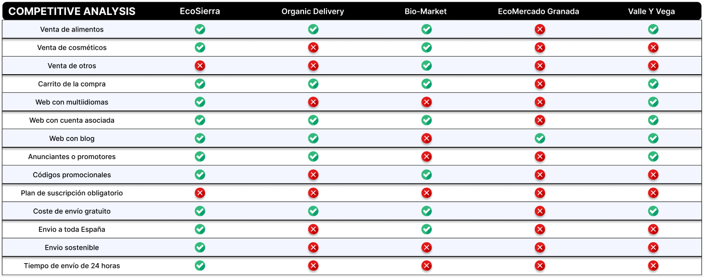
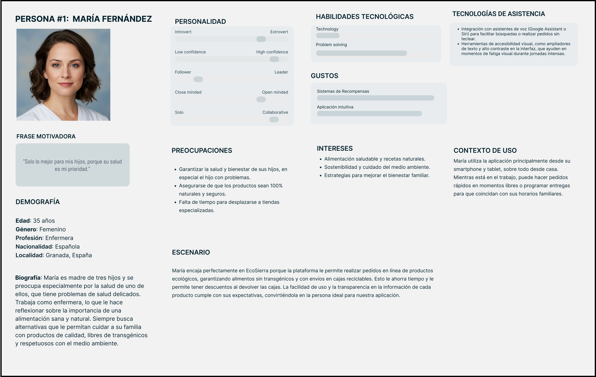
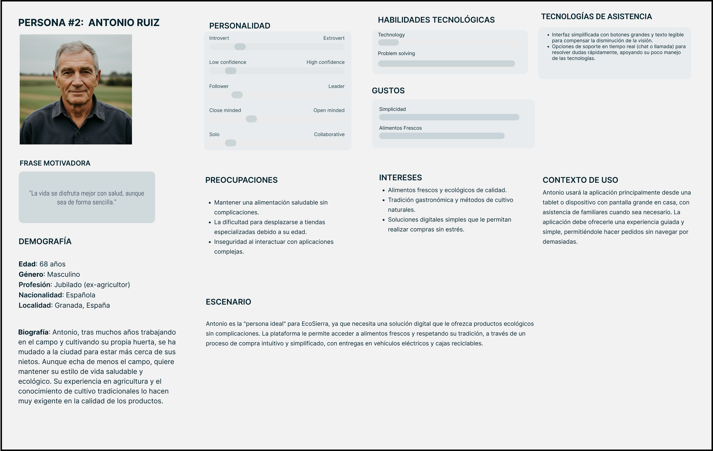
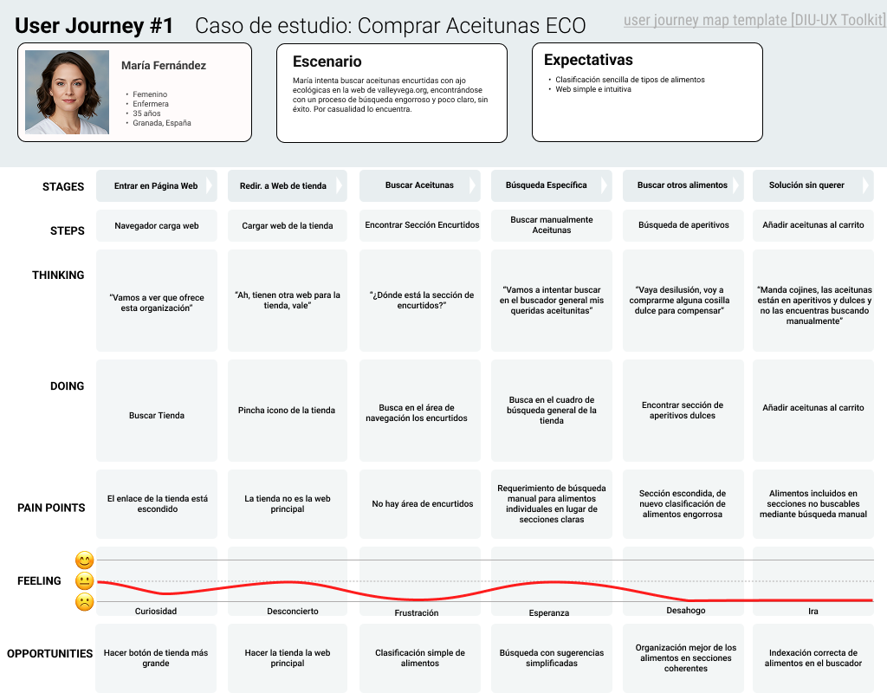
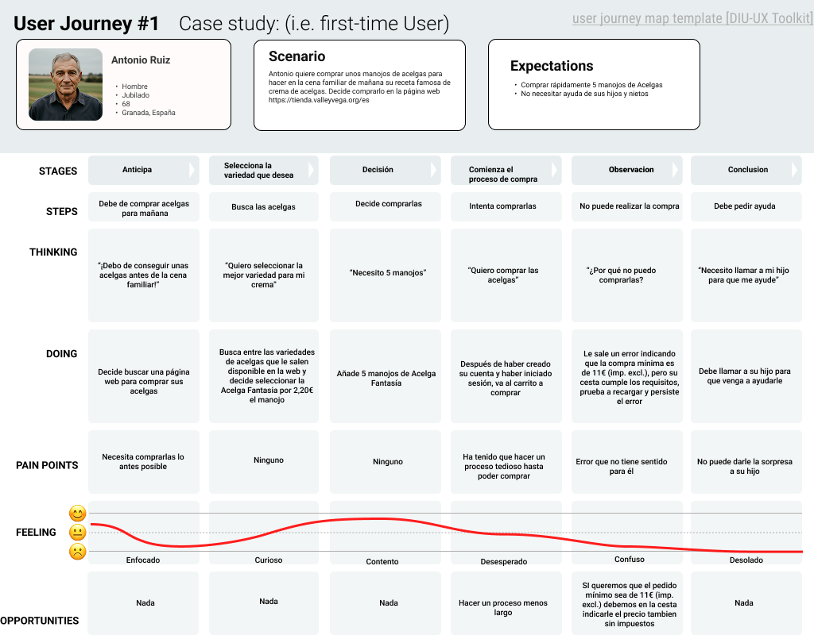

Grupo: DIU1.JavierCarmen.  Curso: 2024/25 

Actualizado: 16/03/2025

Proyecto: EcoSierra Granada

Descripción: 

Se trata de una plataforma digital (web y móvil) que conecta a productores, vendedores y consumidores de mercados ecológicos en Granada. La propuesta se centra en:

- **Envíos Ecoamigables:**  
  No se usa plástico en los envíos. Se utilizan cajas de madera reciclada. Además, si el usuario devuelve el envase, se le ofrece un pequeño descuento en su siguiente compra.  

- **Transporte Sostenible:**  
  Todos los medios de transporte (camiones, camionetas y motos) que se utilizan para la distribución son eléctricos, reduciendo así la huella de carbono.

- **Funcionalidades del Marketplace:**  
  La plataforma permite realizar pedidos en línea con métodos de pago de forma segura. Además, incorpora funcionalidades como el seguimiento de envíos y acceso a reseñas de otros usuarios.

Logotipo: 

<svg xmlns="http://www.w3.org/2000/svg" viewBox="0 0 300 100">
    <rect width="300" height="100" fill="#ffffff"/>
    <!-- Ícono: círculo que simboliza la sostenibilidad y lo ecológico -->
    <circle cx="50" cy="50" r="30" fill="#6DBE45"/>
    <!-- Texto del logotipo -->
    <text x="100" y="60" font-family="Arial, sans-serif" font-size="36" fill="#333333">EcoSierra</text>
</svg>

Slogan: De la sierra a tu mesa

Miembros:
 * Javier Osakar Lozano - https://github.com/javiosl
 * Carmen García Muñoz - https://github.com/cargarmu10

----- 

>>> Este documento es el esqueleto del Case Study que explica el proceso de desarrollo de las 5 prácticas de DIU. Aparte de subir cada entrega a PRADO, se debe actualizar y dar formato de informe final a este documento online. Elimine este tipo de texto / comentarios desde la práctica 1 conforme proceda a cada paso

# Proceso de Diseño 

 

## Paso 1. UX User & Desk Research & Analisis 

### 1.a User Reseach Plan
 
-----

#### 1. Background

Este proyecto se centra en la mejora de la experiencia digital para mercados ecológicos en Granada, España. La investigación busca comprender las necesidades, motivaciones y barreras de los usuarios para diseñar una interfaz que conecte de manera efectiva a consumidores, vendedores, organizadores y promotores publicistas.

#### 2. Objectives

Business Objective & KPIs:
- Incrementar la adopción digital de los mercados ecológicos locales.
- KPIs: Tasa de participación, satisfacción del usuario, y tasa de conversión en acciones (por ejemplo, registro o compra).

Research Success Criteria:

- Recopilar información cualitativa (entrevistas, observaciones) y cuantitativa (cuestionarios).
- Crear documentos como perfiles de usuario, mapas de experiencia y recomendaciones de diseño.
- Fundamentar decisiones de diseño basadas en los insights obtenidos.

#### 3. Research Methods

Se realizará la investigación mediante entrevistas presenciales, observación (etnografía) y contextual inquiry. Esto nos ayuda a connocer las experiencias y expectativas de cada perfil, ayudando a identificar las áreas de mejora en la interfaz.

#### 4. Research Scope & Focus Areas

Question Themes:

Motivaciones y barreras para acudir a mercados ecológicos.
Impacto de la comunicación y promoción en la decisión de compra.

Design Focus Components: Utility, Learnability, Efficiency, Memorability, Errors, Satisfaction, Persuasiveness.

#### 5. (Personal) Experiencia en este campo

- Como stakeholder: Experiencia participando en iniciativas ecológicas.
- Como diseñador: Antecedentes en proyectos centrados en el usuario y sostenibilidad.
- Como observador: Visitas a mercados ecológicos locales.
- User says: Comentarios recogidos de usuarios y promotores sobre la experiencia actual.

#### 6. Reclutamiento de participantes

Se reclutarán al menos tres perfiles:

- Consumidores: Personas que frecuentan o tienen interés en adquirir productos ecológicos.
- Vendedores/Organizadores: Encargados de gestionar los mercados y asegurar la calidad de los productos.
- Promotores (Publicistas): Encargados de impulsar la imagen y alcance de los mercados ecológicos.

### 1.b Competitive Analysis
 
-----
 

### 1.c Personas
 
-----
 
**María Fernández**: Madre de tres hijos y se preocupa especialmente por la salud de uno de ellos, que tiene problemas de salud delicados. Trabaja como enfermera, lo que le hace reflexionar sobre la importancia de una alimentación sana y natural. Siempre busca alternativas que le permitan cuidar a su familia con productos de calidad, libres de transgénicos y respetuosos con el medio ambiente.

 
**Antonio Ruiz**: Tras muchos años trabajando en el campo y cultivando su propia huerta, se ha mudado a la ciudad para estar más cerca de sus nietos. Aunque echa de menos el campo, quiere mantener su estilo de vida saludable y ecológico. Su experiencia en agricultura y el conocimiento de cultivo tradicionales lo hacen muy exigente en la calidad de los productos.

### 1.d User Journey Map
 
----
Los dos User Journey son situaciones comunes en la página web de www.valleyvega.org, en las que se intenta buscar un alimento y comprarlo. Ambas situaciones son increiblemente engorrosas y están mal diseñadas, con cantidad de fallos en todos los pasos del proceso.

A nuestra usuaria María Fernández le han recomendado comprar una variedad específica de aceitunas y no las ha podido encontrar mediante la búsqueda que supuestamente indexa todo el contenido de la web.

A nuestro usuario Antonio Ruiz ha decidido realizar una compra de acelgas para su familia pero debido a un error poco intuitivo no ha sido capaz de conseguirlo y tuvo que pedir ayuda a un familiar más joven.

### 1.e Usability Review
 
----
- **Enlace al documento**:  
- **URL y Valoración numérica obtenida**: www.valleyvega.org / www.tienda.valleyvega.org - 60/100
- **Comentario sobre la revisión**:  Las web principal y tienda son webs diferentes y a la tienda es engorroso acceder, demostrando poca organización y coherencia en la estructura. La tienda contiene una serie de secciones mal organizadas y una búsqueda mal indexada con alimentos disponibles mediante las secciones pero no la búsqueda, algo completamente incomprensible. El checkout es engorroso y el precio mínimo no está bien clarificado. Por lo demás la web presenta un diseño atractivo con una paleta de colores agradable y una tipografía clara y legible.