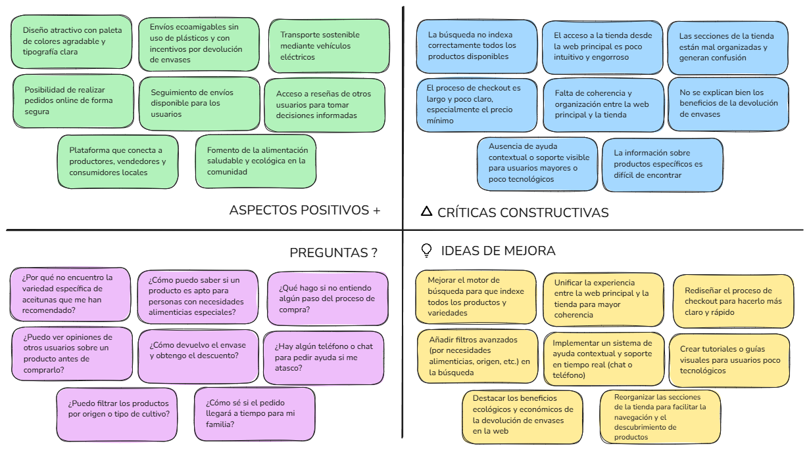
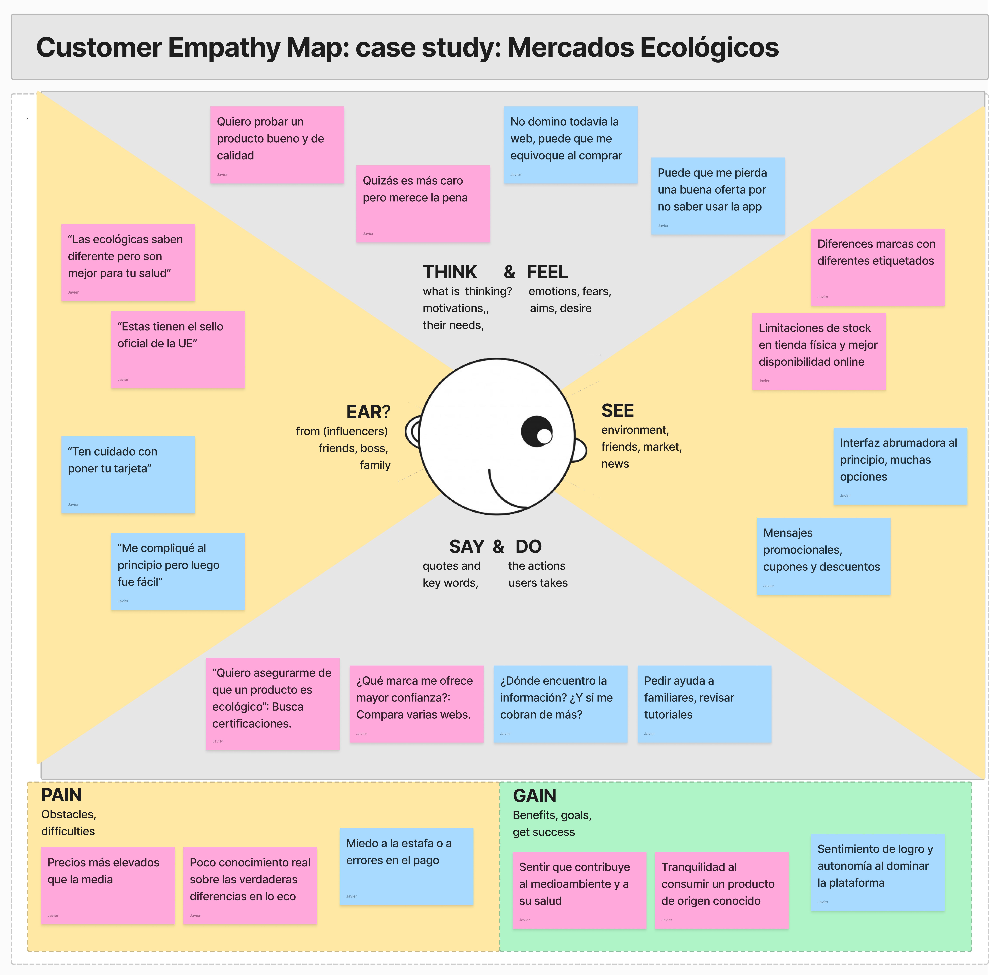
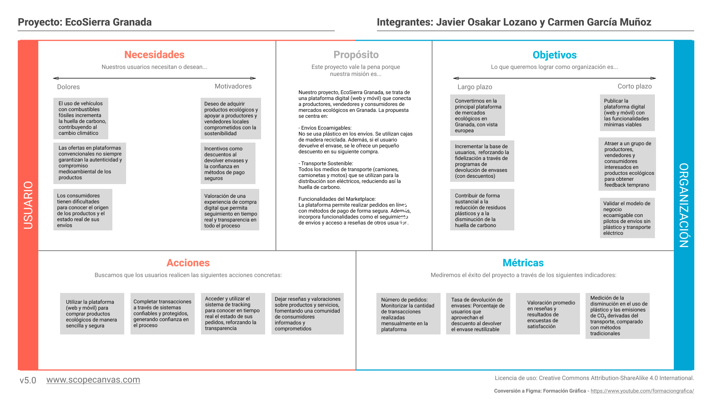
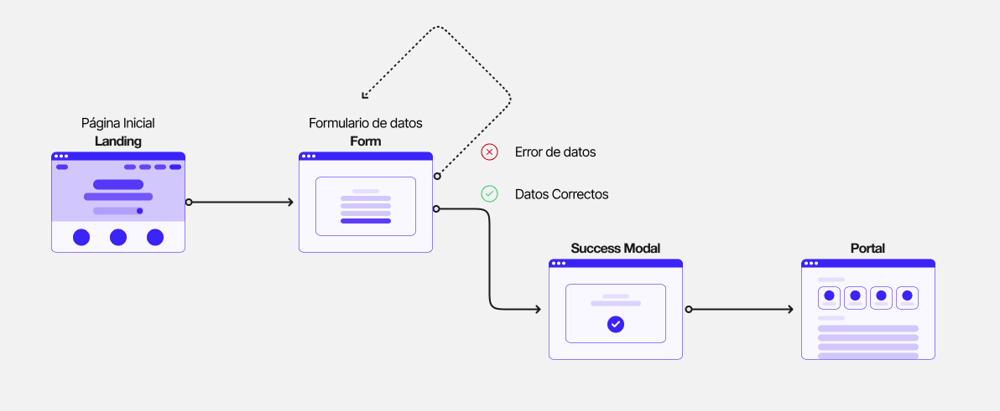
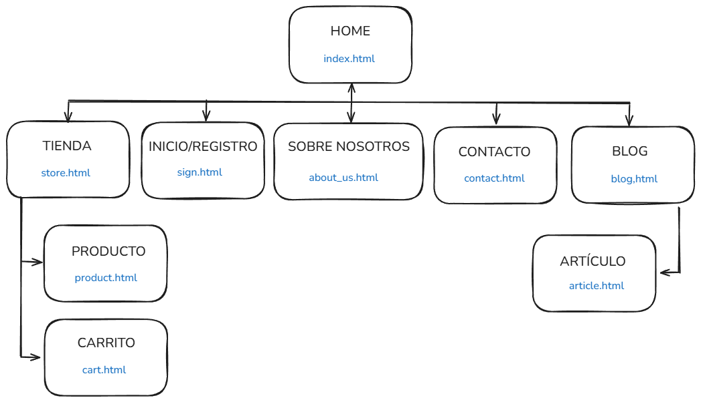
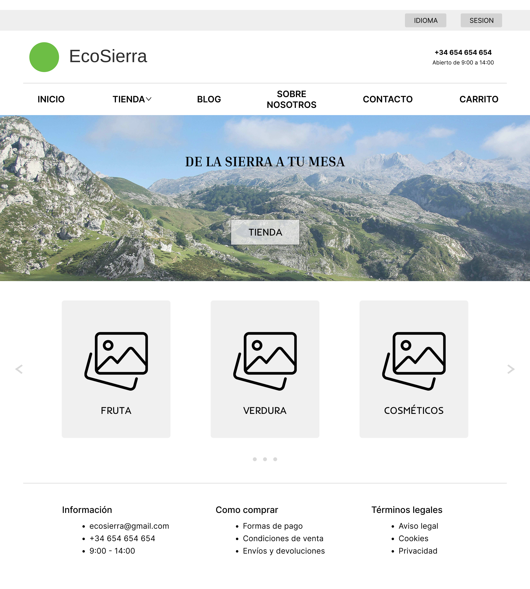
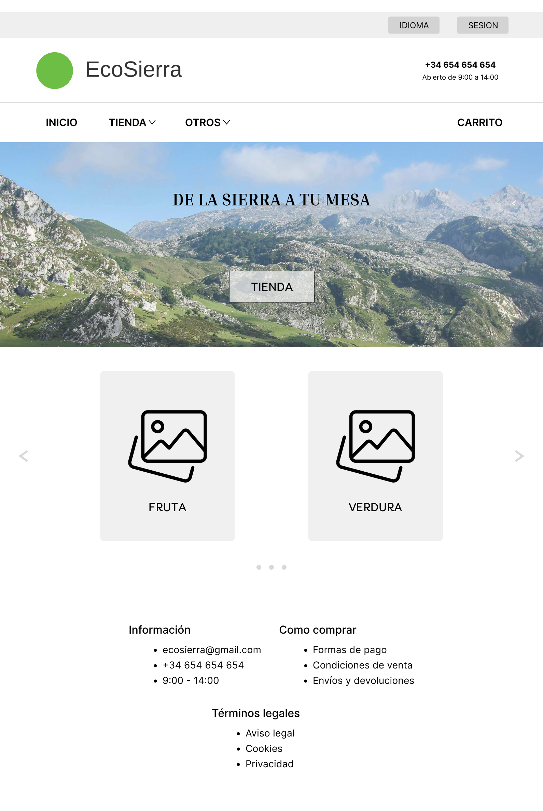
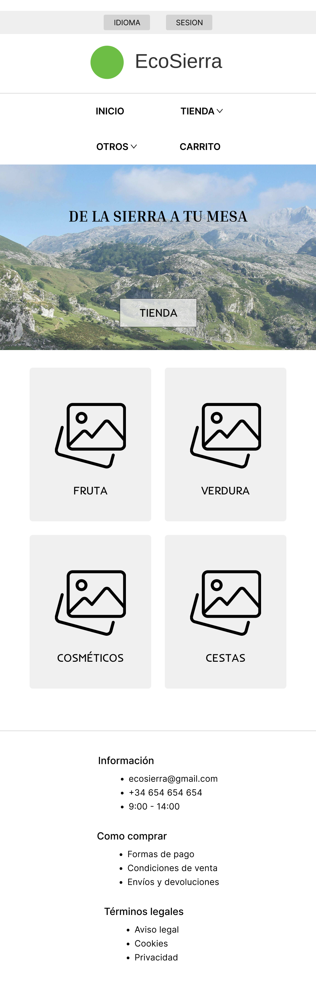
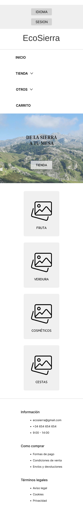

## DIU - Practica 2

Grupo: DIU1.JavierCarmen.  Curso: 2024/25
Miembros:
 * Javier Osakar Lozano - https://github.com/javiosl
 * Carmen García Muñoz - https://github.com/cargarmu10

### Ideación 
* Malla receptora de información

* Mapa de empatía

### PROPUESTA DE VALOR (Scope Canvas)

Nuestro proyecto, EcoSierra Granada, se trata de una plataforma digital (web y móvil) que conecta a productores, vendedores y consumidores de mercados ecológicos en Granada. La propuesta se centra en:

- Envíos Ecoamigables:
No se usa plástico en los envíos. Se utilizan cajas de madera reciclada. Además, si el usuario devuelve el envase, se le ofrece un pequeño descuento en su siguiente compra.

- Transporte Sostenible:
Todos los medios de transporte (camiones, camionetas y motos) que se utilizan para la distribución son eléctricos, reduciendo así la huella de carbono.

Funcionalidades del Marketplace:
La plataforma permite realizar pedidos en línea con métodos de pago de forma segura. Además, incorpora funcionalidades como el seguimiento de envíos y acceso a reseñas de otros usuarios.

### TASK ANALYSIS

* User Task Matrix

Hemos definido la siguiente Task Matrix con 15 tareas y 5 roles de usuario. Los roles considerados son: Consumidor, Vendedor, Productor, Repartidor y Administrador. Se considera una puntuación de prioridad del 1 al 5 (5 = más alta), y se incluye la suma total de puntos para cada tarea al final.

| Tarea                                    | Consumidor | Vendedor | Productor | Repartidor | Administrador | Total |
|------------------------------------------|------------|----------|-----------|------------|---------------|-------|
| 1. Buscar productos                      | 5          | 2        | 1         | 1          | 2             | 11    |
| 2. Ver detalles del producto             | 5          | 2        | 1         | 1          | 1             | 10    |
| 3. Realizar pedido                        | 5          | 3        | 2         | 2          | 2             | 14    |
| 4. Pagar compra                           | 5          | 2        | 1         | 1          | 1             | 10    |
| 5. Rastrear envío                         | 5          | 3        | 2         | 5          | 2             | 17    |
| 6. Calificar/reseñar producto             | 4          | 2        | 1         | 1          | 1             | 9     |
| 7. Gestionar devolución del envase        | 5          | 2        | 1         | 1          | 2             | 11    |
| 8. Contactar con servicio al cliente      | 4          | 2        | 1         | 1          | 3             | 11    |
| 9. Registrar cuenta                       | 5          | 5        | 5         | 5          | 3             | 23    |
| 10. Editar perfil                         | 4          | 4        | 4         | 4          | 2             | 18    |
| 11. Gestionar inventario                  | 1          | 5        | 4         | 1          | 3             | 14    |
| 12. Añadir producto                       | 1          | 5        | 5         | 1          | 3             | 15    |
| 13. Gestionar promociones                 | 2          | 4        | 3         | 1          | 3             | 13    |
| 14. Ver historial de pedidos              | 5          | 3        | 1         | 1          | 2             | 12    |
| 15. Gestionar devoluciones                | 3          | 3        | 2         | 2          | 3             | 13    |

* User/Task flow (Inicio Sesión)

### ARQUITECTURA DE INFORMACIÓN

* Sitemap

* Labelling
  | Nombre | Descripción |
  | --- | --- |
  | Home (index.html) | Página de inicio de la web |
  | Tienda (store.html) | Página en la que se mostrará nuestra tienda con diferentes tipos de filtros |
  | Producto (product.html) | Página de producto, se muestrá el producto seleccionado y productos relacionados |
  | Carrito (cart.html) | Página de carrito, se mostrarán un listado de productos añadidos con su respectiva cantidad y precios |
  | Inicio/registro (sign.html) | Página de inicio y registro de la web. Dependiendo de que acción se desea hacer se usa un formulario u otro |
  | Sobre Nosotros (about_us.html) | Página en la que se indica información que se desea dar a conocer a nuestro público |
  | Contacto (contact.html) | Página de contacto para el público sobre posibles dudas o incidencias a través de un formulario |
  | Blog (blog.html) | Página de noticias con temática ecológica, donde se muestrán diferentes articulos resumidos |
  | Articulo (article.html) | Página de artículo donde se muestra la información de manera más extensa |

### Prototipo Lo-FI Wireframe 
Se han realizado tres bocetos de las páginas correspondientes al inicio, a la tienda y al visualizador de producto. Mediante Figma se ha hehco un diseño responsive, que mostraremos imágenes de los diferentes frames de cada una de ellas.

#### 1920x1590

#### 1590x1200

#### 1200x600

#### 600x320

### Conclusiones  
En esta práctica hemos definido la intención de nuestro proyecto, así como la arquitectura de información y el flujo de usuario. Hemos realizado un análisis de tareas y un prototipo inicial para validar la usabilidad y la experiencia del usuario.

Hemos aprendido a usar mejor herramientas como Figma y a trabajar con herramientas gráficas para definir cómo se vería nuestro servicio.

