# DIU - Practica 3

Grupo: DIU1.JavierCarmen.  Curso: 2024/25
Miembros:
 * Javier Osakar Lozano - https://github.com/javiosl
 * Carmen García Muñoz - https://github.com/cargarmu10

# 1. MOODBOARD

## LOGOTIPO

- Imagen .png
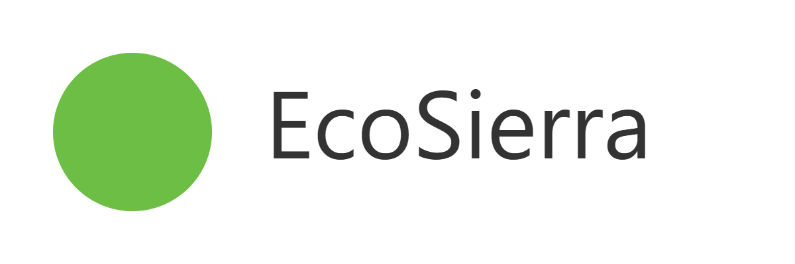

- Vectorial .svg
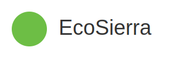

Hemos querido elegir un logotipo simple y directo, compuesto con el color verde como color principal, muy representativo de lo natural y ecológico, y el texto del nombre de la marca. La tipografía es sencilla y clara, para que sea fácil de leer y recordar y sobre todo de usar en plataformas web y móviles.

## PALETA DE COLORES

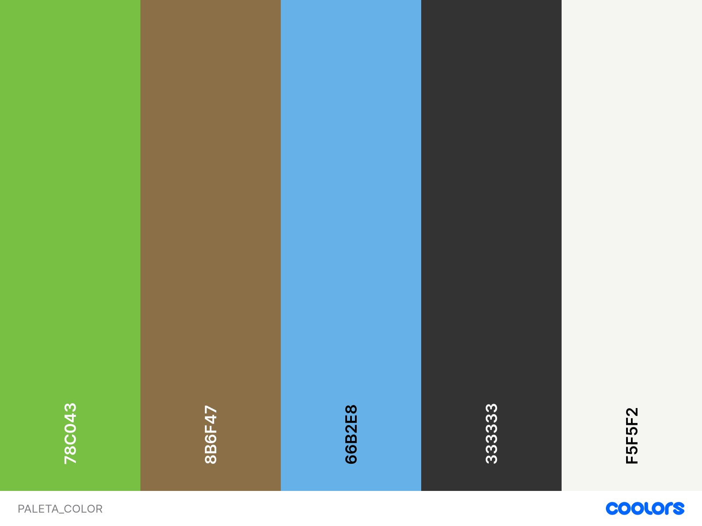

| Muestra | Nombre                | Hex       | Uso / Justificación                                                                                         |
|:-------:|:----------------------|:----------|:-------------------------------------------------------------------------------------------------------------|
| 🟩      | **Verde Natural**     | `#78C043` | Color principal, tomado del logo. Evoca naturaleza, frescura y ecología.                                     |
| 🟫      | **Madera Reciclada**  | `#8B6F47` | Acento que recuerda las cajas de madera reciclada. Aporta calidez y refuerza el concepto “eco‐packaging”.     |
| 🟦      | **Azul Claro**        | `#66B2E8` | Color secundario para llamadas a la acción o elementos de tracking; ofrece sensación de confianza y tecnología. |
| ⚫️      | **Gris Carbón**       | `#333333` | Para texto y elementos UI; alto contraste y buena legibilidad sobre fondos claros.                          |
| ⚪️      | **Crema Suave**       | `#F5F5F2` | Fondo general; proporciona calidez y hace que los productos destaquen sin “cansar” la vista.                 |

## ICONOS/SÍMBOLOS Y ESTILO (HeroIcons)

### Estilo general

| Propiedad        | Valor                                  |
|:-----------------|:---------------------------------------|
| **Familia**      | Outline / Stroke                       |
| **Grosor**       | 2 px                                   |
| **Line cap/join**| Round                                  |
| **Tamaño base**  | 24 × 24 px (32 × 32 px en heroicons)   |
| **Color normal** | `#333333` (Gris Carbón)               |
| **Color hover**  | `#78C043` (Verde Natural)             |

---

### Iconos de navegación y acciones globales

| Uso                | Icono                                                                                                                                                                                         |
|:-------------------|:----------------------------------------------------------------------------------------------------|
| Menú hamburguesa   |  |
| Carrito de compra  |     |
| Usuario / sesión   |      |
| Selección de idioma|     |
| Buscar             |    |
| Teléfono           |     |
| Correo electrónico |     |
| Ubicación          |     |

### Iconos de filtro y ordenación (columna lateral)

| Filtro / Orden        | Icono                                                                                           | Estado activo     |
|:----------------------|:------------------------------------------------------------------------------------------------|:------------------|
| Desplegable           |  | Rotar 180° (▲)    |
| Más vendidos          |   | Color `#78C043`   |
|

### Iconos de producto y carrito (detalle de producto)

| Acción            | Icono                                                                                             |
|:------------------|:--------------------------------------------------------------------------------------------------|
| Añadir al carrito |      |
| Quitar (-)        |     |
| Envío             |      |
| Devolver envase   |       |

### Iconos de estado y feedback

| Tipo                | Icono                                                                                           | Color              |
|:--------------------|:-----------------------------------------------------------------------------------------------|:-------------------|
| Éxito / Descuento   |  | `#78C043` (verde)  |
| Alerta / Error      |  | `#E94E4E` (rojo)   |
| Información extra   |          | `#66B2E8` (azul)   |

## IMÁGENES INSPIRADORAS

#### Conexión entre productor y consumidor, enfoque sostenible, entorno local.
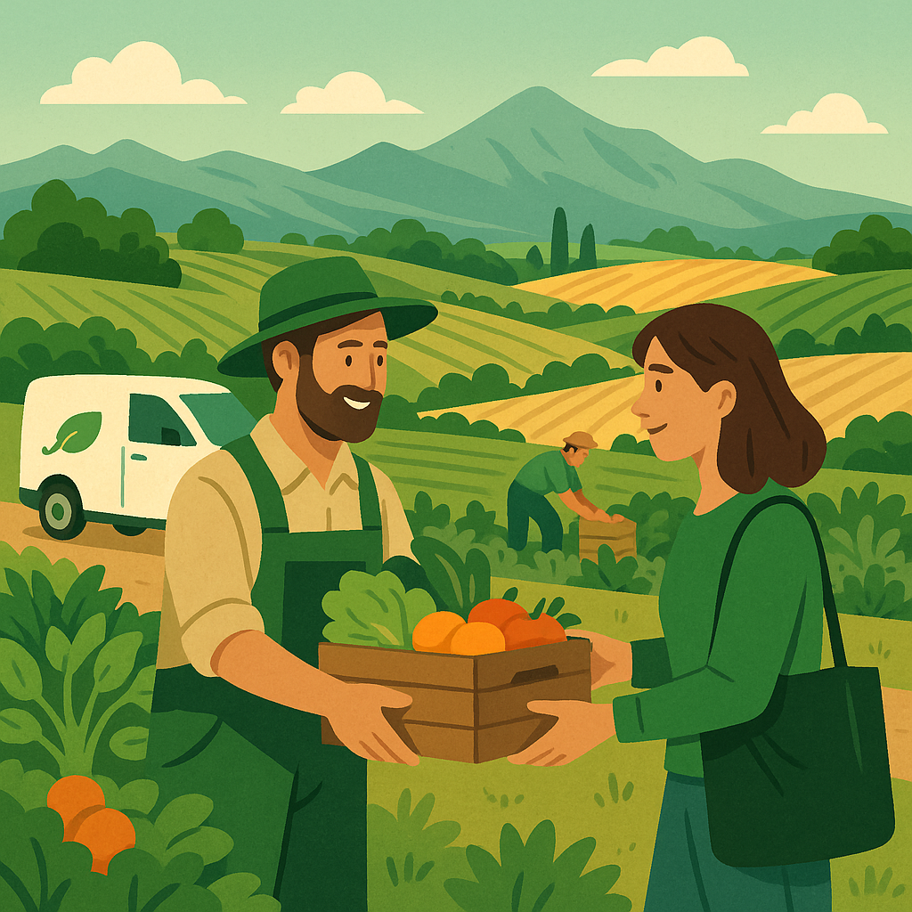

#### Devolución de envases reciclables, descuentos o cupones, sostenibilidad.
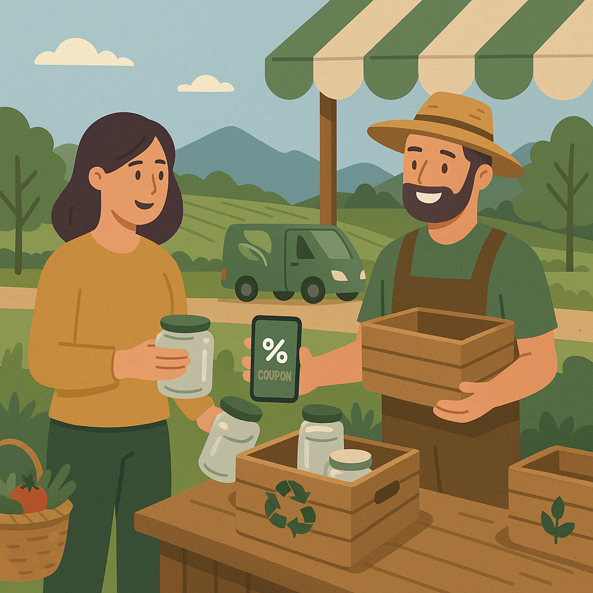

#### Transporte eléctrico, packaging sostenible, funcionalidad digital.
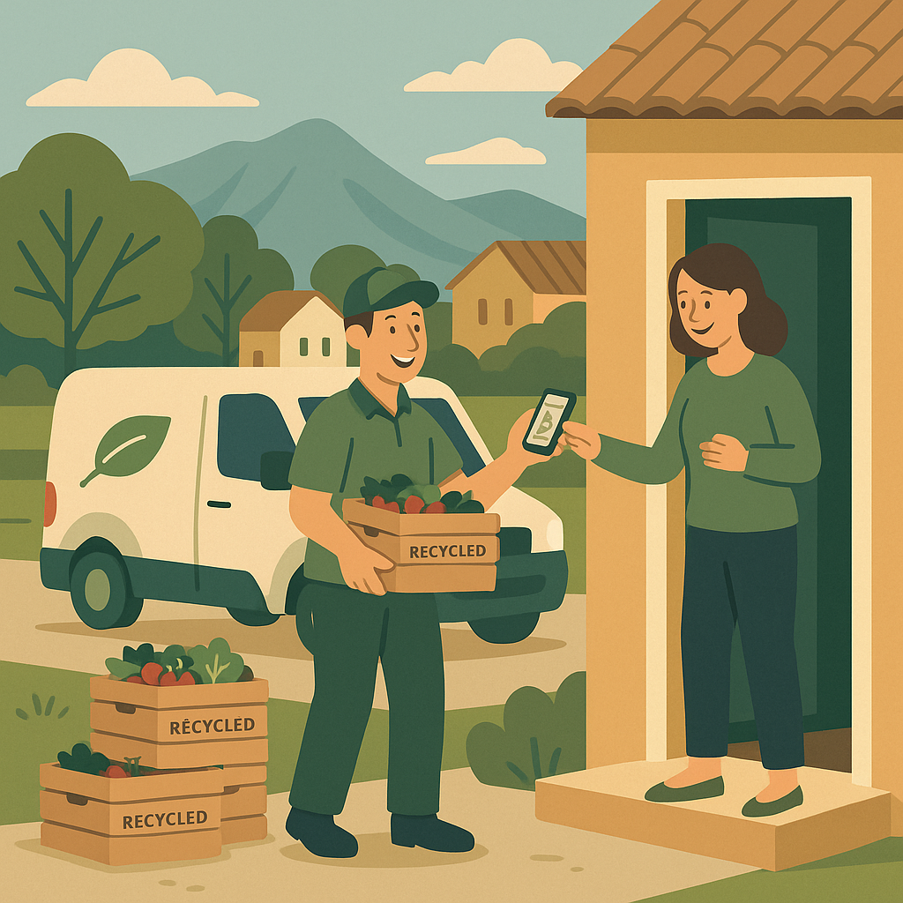

# 2. LANDING PAGE

Se ha diseñado la siguiente página promocional, conteniendo el logotipo, una breve descripción de la empresa y dos imágenes inspiradoras que expresan la filosofía y valores de la marca. Finalmente se presenta un botón de llamada a la acción que invita al usuario a ayudar a nuestro planeta, con el enlace a la web de la empresa.

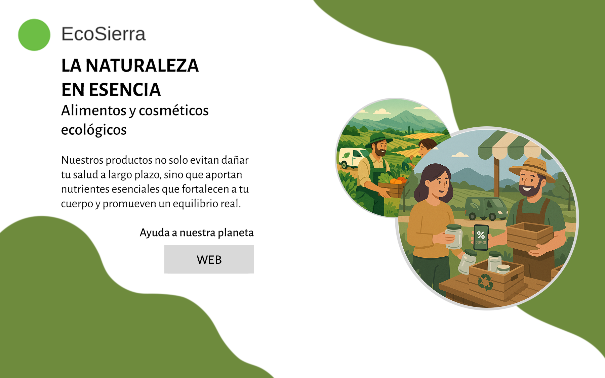

# 3. MOCKUP: LAYOUT HI-FI

## Patrones de diseño

Se ha realizado un mockup con navegabilidad simulada mediante animaciones de la aplicación para web [Mockup en Figma](https://www.figma.com/design/NFUHxHGGa9HnGKbSnbm49o/Protocolo-TOTAL-RP?m=auto&t=lJTwSbpXoMqKUMaR-6), utilizando los siguientes patrones de diseño:

### Hero Image + Carousel (Página de inicio)
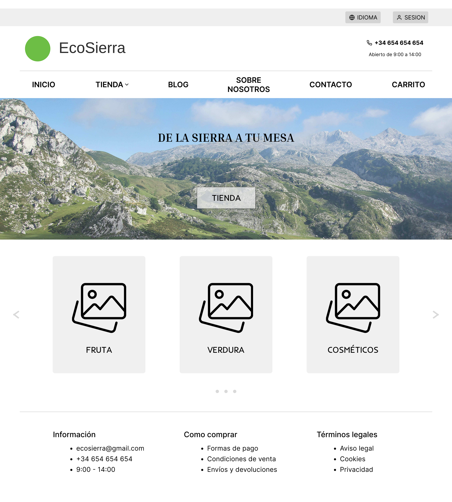

### Menú hamburguesa (SubMenú)
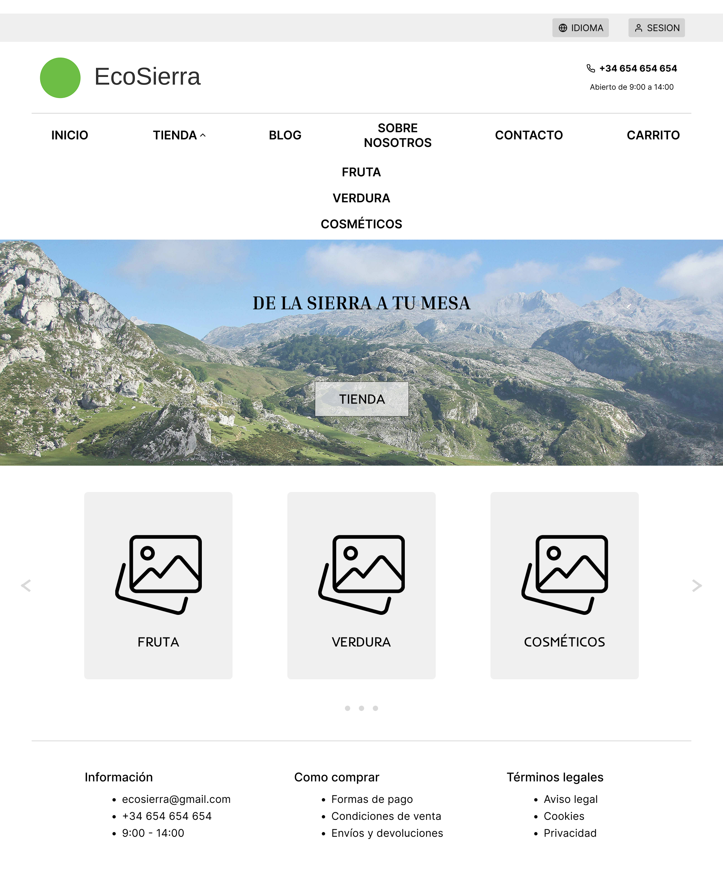

### Article List (Tienda)
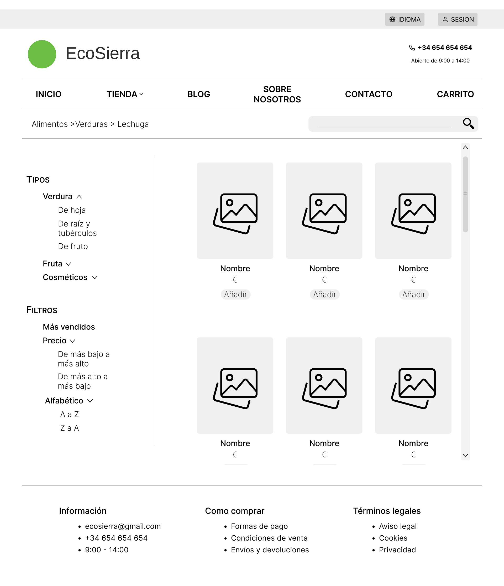

### Item Details (Detalles del producto)
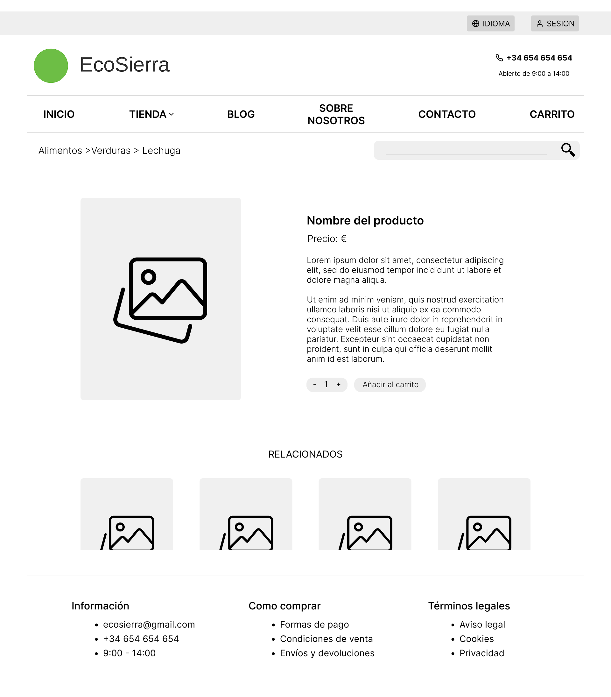

### Form Input (Contacto)
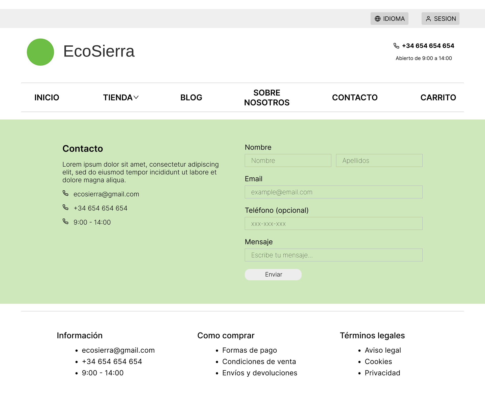

### Shopping Cart (Carrito de compra)
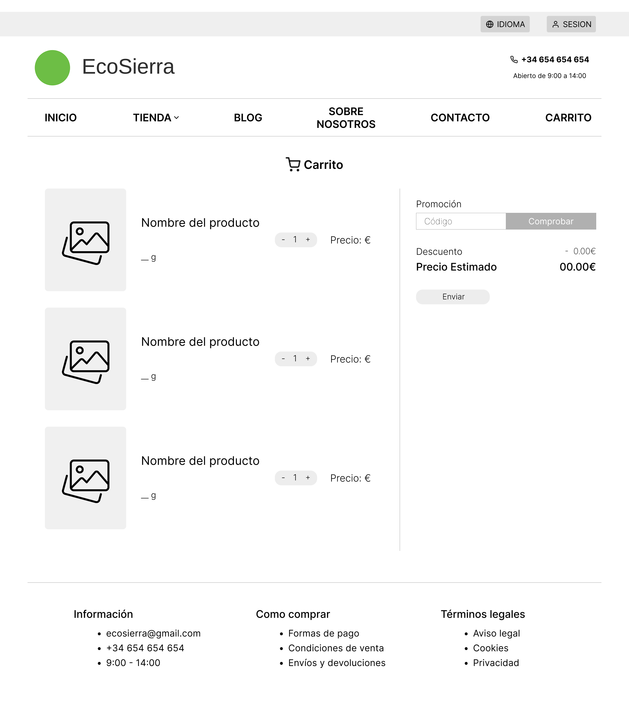

### About (Sobre nosotros)
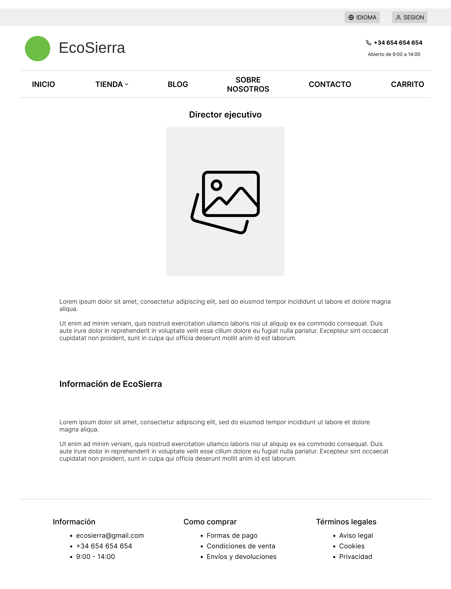

## CONCLUSIONES

Hemos podido aplicar los conocimientos adquiridos en clase a raiz de las actividades del moodboard y el onboarding para un caso práctico real. Hemos utilizado Figma solamente para la navegabilidad, haciendo el moodboard a raiz de ideas propias de lo que deberían ser un logotipo, paleta de colores e iconos. 

Los patrones de diseño utilizados, aunque restringidos a los necesarios para la práctica, nos han permitido explorar la versatilidad de la aplicación y su potencial para una experiencia de usuario fluida y atractiva.

En general la práctica, aunque ha sido laboriosa y tediosa por el desconocimiento de ciertas herramientas en Figma, ha materializado las ideas que teníamos en mente y nos ha permitido ver cómo se pueden aplicar los conceptos de diseño a un caso práctico real.