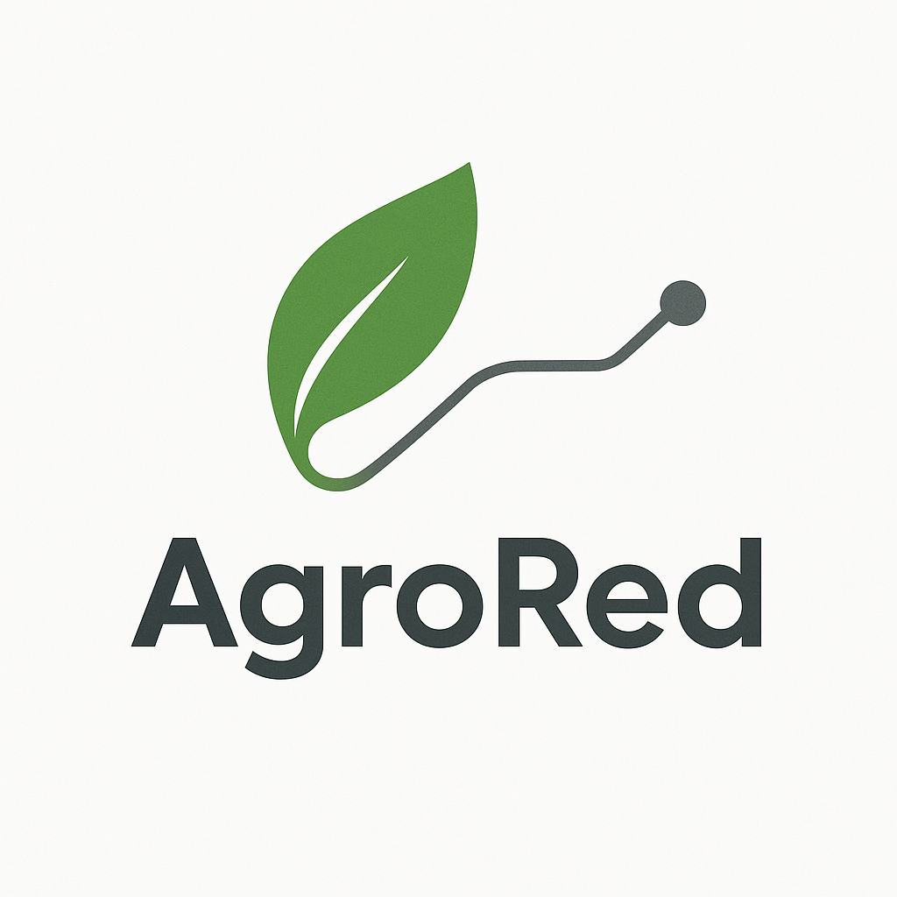
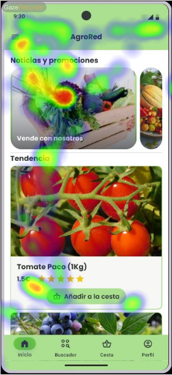
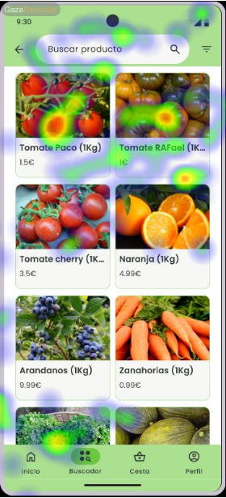
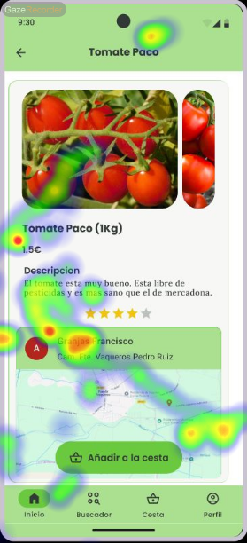
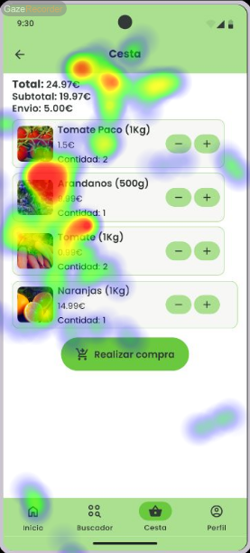
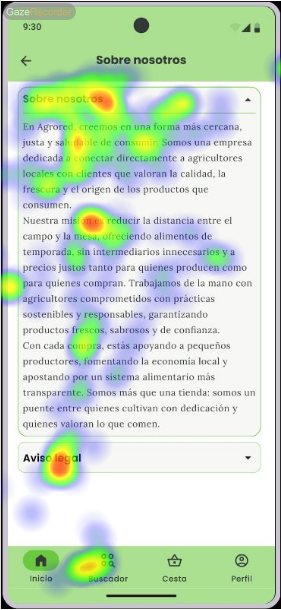

# Usability Report

#### Evaluación de usabilidad del proyecto 

### AgroRed

### 01/06/2025

[https://github.com/AlexMr08/UX_CaseStudy](https://github.com/AlexMr08/UX_CaseStudy)

### Realizado por:

DIU1.JavierCarmen

## 1 DESCRIPCIÓN DEL WEBSITE

Se trata de una plataforma web para que los agricultores locales vendan sus productos directamente al consumidor, sin intermediarios y con menos transporte. Se prevee para el futuro que las entregas se hagan con vehículos de bajas emisiones para gastar menos energía. Así, los agricultores ponen sus precios con más margen de ganancia y los clientes compran más barato. Además, al fomentar cultivos nativos se usa mejor el agua y se reducen fertilizantes y pesticidas.

## 2 RESUMEN EJECUTIVO

En este documento se presenta el informe de usabilidad del proyecto AgroRed, que tiene como objetivo evaluar la experiencia de usuario y la facilidad de uso de la plataforma web diseñada para conectar a agricultores locales con consumidores finales.

## 3 METODOLOGIA 

#### Metodología de usabililidad

La metodología utilizada para la evaluación de usabilidad del proyecto AgroRed se basa en dos técnicas complementarias: el cuestionario SUS (System Usability Scale) y el análisis de eyetracking. Estas técnicas permiten obtener una visión integral de la experiencia del usuario, identificando tanto problemas de usabilidad como áreas de mejora.

#### Test de usuarios: Participantes

Vamos a tener una muestra de 4 usuarios a las que se aplicarán las diferentes pruebas para obtener un resultado.

|   |   |   |   |   |   |   |   |
|---|---|---|---|---|---|---|---|
|#id. usuario|Sexo/edad|Ocupación|Experiencia internet|Plataforma|Perfil cubierto|TEST|SUS score|
|1|M/26|Estudiante universitario|Avanzado|PC|B|TEST|SUS score|
|2|F/23|Estudiante universitario|Avanzado|PC|B|TEST|SUS score|
|3|F/55|Administrativa|Básico|PC|B|TEST|SUS score|
|4|M/31|Marketing digital|Avanzado|Móvil/PC|B|TEST|SUS score|

#### Resultados obtenidos

El cuestionario SUS (System Usability Scale) consta de 10 preguntas estándar que los usuarios deben calificar en una escala de 1 (totalmente en desacuerdo) a 5 (totalmente de acuerdo):

1. Creo que me gustaría usar este sistema frecuentemente
2. Encontré el sistema innecesariamente complejo
3. Pensé que el sistema era fácil de usar
4. Creo que necesitaría el apoyo de un técnico para poder usar este sistema
5. Encontré que las diversas funciones en este sistema estaban bien integradas
6. Pensé que había demasiada inconsistencia en este sistema
7. Me imagino que la mayoría de las personas aprenderían a usar este sistema muy rápidamente
8. Encontré el sistema muy engorroso de usar
9. Me sentí muy seguro usando el sistema
10. Necesité aprender muchas cosas antes de poder comenzar con este sistema

#### Caso B (Usuarios 5-8)

| Usuario | P1 | P2 | P3 | P4 | P5 | P6 | P7 | P8 | P9 | P10 | Puntuación SUS |
|---------|----|----|----|----|----|----|----|----|----|----|----------------|
| 5 (F/42) | 3 | 3 | 3 | 3 | 3 | 3 | 3 | 3 | 3 | 3 | 60 |
| 6 (M/19) | 4 | 2 | 4 | 2 | 3 | 3 | 4 | 2 | 3 | 2 | 75 |
| 7 (F/55) | 2 | 4 | 2 | 4 | 2 | 4 | 2 | 4 | 2 | 4 | 30 |
| 8 (M/31) | 4 | 2 | 4 | 2 | 3 | 3 | 4 | 2 | 4 | 2 | 77.5 |

**Promedio Caso B: 60.625**

### Cálculo del Net Promoter Score (NPS)

Para calcular el NPS, utilizamos la pregunta 1 del cuestionario SUS como indicador de recomendación, convirtiendo la escala de 5 puntos a una escala de 10 puntos:

#### Clasificación de usuarios:
- **Promotores** (puntuación 9-10): Usuarios que respondieron 5 en P1
- **Pasivos** (puntuación 7-8): Usuarios que respondieron 4 en P1  
- **Detractores** (puntuación 0-6): Usuarios que respondieron 1-3 en P1

#### Resultados NPS:
**Caso B:**
- Promotores: 0 usuarios (0%)
- Pasivos: 3 usuarios (75%) - Usuarios 6, 8
- Detractores: 1 usuario (25%) - Usuario 7
- **NPS Caso B: -25%**

Se ha creado un test en la plataforma de Gazerecorder, se han añadido las template de: inicio, tienda, producto, carrito y sobre nosotros.

**Enlace al test caso B**: https://app.gazerecorder.com/Study/Test?StudyID=ef4248359652a88fa04db8e9bb470c07&lang=es&RespondentID=null

Adjuntamos las fotos de los resultados del test:

Las cuestiones a valorar serán: eficiencia en la fijación de elementos importantes, distribución de la atención. Utilizamos estas méticas porque nos ayudan a confirmar que la interfaz lleva la atención del usuario a elementos importantes pero que también permiten la visualización del resto de la página.

#### Valoración EYETRACKING EN %

| INICIO | PRODUCTO | CARRITO | TIENDA | ABOUT US | TOTAL |
|----|----|----|----|----|----|
| 82% | 85% | 88% | 80% | 75% | 82% |

Aunque mayoritariamente sea correcta la puntuación a grandes rasgos son un diseño visual más atractivo, una mejor atención sobre los filtros de búsqueda, algo de visualización sobre el footer y sobre la navegación lateral.

## 4 CONCLUSIONES

Con las pruebas de usabilidad realizadas, se ha podido identificar una serie de problemas y áreas de mejora en la plataforma AgroRed. 
Estos problemas afectan tanto a la navegación como a la estructura del sitio web, lo que puede dificultar la experiencia del usuario y limitar la efectividad de la plataforma para cumplir su objetivo de conectar a agricultores locales con consumidores finales.

#### Incidencias

Alguno de los problemas detectados incluyen:

* Dificultades en la navegación del sitio web, especialmente la distribución en la página de inicio.
* La estructura de la página y su navegabilidad.
* Falta de filtro de búsqueda en la sección de productos (solo se puede buscar por nombre).
* Solo hay una manera de contactar con la empresa que es con el formulario de contacto. Faltan opciones como correo electrónico, teléfono o redes sociales.
* Algunas faltas ortográficas.
* Algunas inconsistencias en el diseño de botones.

#### Valoración 

* La plataforma es intuitiva y fácil de usar en general.
* La plataforma cumple con su objetivo de conectar a agricultores locales con consumidores finales.
* La plataforma es accesible desde diferentes dispositivos, incluyendo móviles y tablets.
* La plataforma tiene un diseño atractivo y moderno.

#### Valoración de la prueba de usabilidad (self-assesment)

* Este tipo de pruebas son muy útiles para detectar problemas de usabilidad que pueden no ser evidentes en una revisión inicial del sitio web.
* Las pruebas de usabilidad permiten obtener una visión más objetiva de la experiencia del usuario y ayudan a identificar áreas de mejora que pueden no ser evidentes para los desarrolladores o diseñadores.
