# DIU25
Prácticas Diseño Interfaces de Usuario (Tema: Mercados Ecológicos) 

[Guiones de pr√°cticas](GuionesPracticas/)

Grupo: DIU1.JavierCarmen.  Curso: 2024/25 

Actualizado: 16/03/2025

Proyecto: EcoSierra Granada

Descripción: 

Se trata de una plataforma digital (web y móvil) que conecta a productores, vendedores y consumidores de mercados ecológicos en Granada. La propuesta se centra en:

- **Envíos Ecoamigables:**  
  No se usa plástico en los envíos. Se utilizan cajas de madera reciclada. Además, si el usuario devuelve el envase, se le ofrece un pequeño descuento en su siguiente compra.  

- **Transporte Sostenible:**  
  Todos los medios de transporte (camiones, camionetas y motos) que se utilizan para la distribución son eléctricos, reduciendo así la huella de carbono.

- **Funcionalidades del Marketplace:**  
  La plataforma permite realizar pedidos en línea con métodos de pago de forma segura. Además, incorpora funcionalidades como el seguimiento de envíos y acceso a reseñas de otros usuarios.

Logotipo: 

<svg xmlns="http://www.w3.org/2000/svg" viewBox="0 0 300 100">
    <rect width="300" height="100" fill="#ffffff"/>
    <!-- Ícono: círculo que simboliza la sostenibilidad y lo ecológico -->
    <circle cx="50" cy="50" r="30" fill="#6DBE45"/>
    <!-- Texto del logotipo -->
    <text x="100" y="60" font-family="Arial, sans-serif" font-size="36" fill="#333333">EcoSierra</text>
</svg>

 

Slogan: De la sierra a tu mesa

Miembros:
 * Javier Osakar Lozano - https://github.com/javiosl
 * Carmen García Muñoz - https://github.com/cargarmu10

 

# Proceso de Diseño 

## Paso 1. UX User & Desk Research & Analisis 

### 1.a User Reseach Plan
 
-----

#### 1. Background

Este proyecto se centra en la mejora de la experiencia digital para mercados ecológicos en Granada, España. La investigación busca comprender las necesidades, motivaciones y barreras de los usuarios para diseñar una interfaz que conecte de manera efectiva a consumidores, vendedores, organizadores y promotores publicistas.

#### 2. Objectives

Business Objective & KPIs:
- Incrementar la adopción digital de los mercados ecológicos locales.
- KPIs: Tasa de participación, satisfacción del usuario, y tasa de conversión en acciones (por ejemplo, registro o compra).

Research Success Criteria:

- Recopilar información cualitativa (entrevistas, observaciones) y cuantitativa (cuestionarios).
- Crear documentos como perfiles de usuario, mapas de experiencia y recomendaciones de diseño.
- Fundamentar decisiones de diseño basadas en los insights obtenidos.

#### 3. Research Methods

Se realizará la investigación mediante entrevistas presenciales, observación (etnografía) y contextual inquiry. Esto nos ayuda a connocer las experiencias y expectativas de cada perfil, ayudando a identificar las áreas de mejora en la interfaz.

#### 4. Research Scope & Focus Areas

Question Themes:

Motivaciones y barreras para acudir a mercados ecológicos.
Impacto de la comunicación y promoción en la decisión de compra.

Design Focus Components: Utility, Learnability, Efficiency, Memorability, Errors, Satisfaction, Persuasiveness.

#### 5. (Personal) Experiencia en este campo

- Como stakeholder: Experiencia participando en iniciativas ecológicas.
- Como diseñador: Antecedentes en proyectos centrados en el usuario y sostenibilidad.
- Como observador: Visitas a mercados ecológicos locales.
- User says: Comentarios recogidos de usuarios y promotores sobre la experiencia actual.

#### 6. Reclutamiento de participantes

Se reclutar√°n al menos tres perfiles:

- Consumidores: Personas que frecuentan o tienen interés en adquirir productos ecológicos.
- Vendedores/Organizadores: Encargados de gestionar los mercados y asegurar la calidad de los productos.
- Promotores (Publicistas): Encargados de impulsar la imagen y alcance de los mercados ecológicos.

### 1.b Competitive Analysis
 
-----
 

### 1.c Personas
 
-----
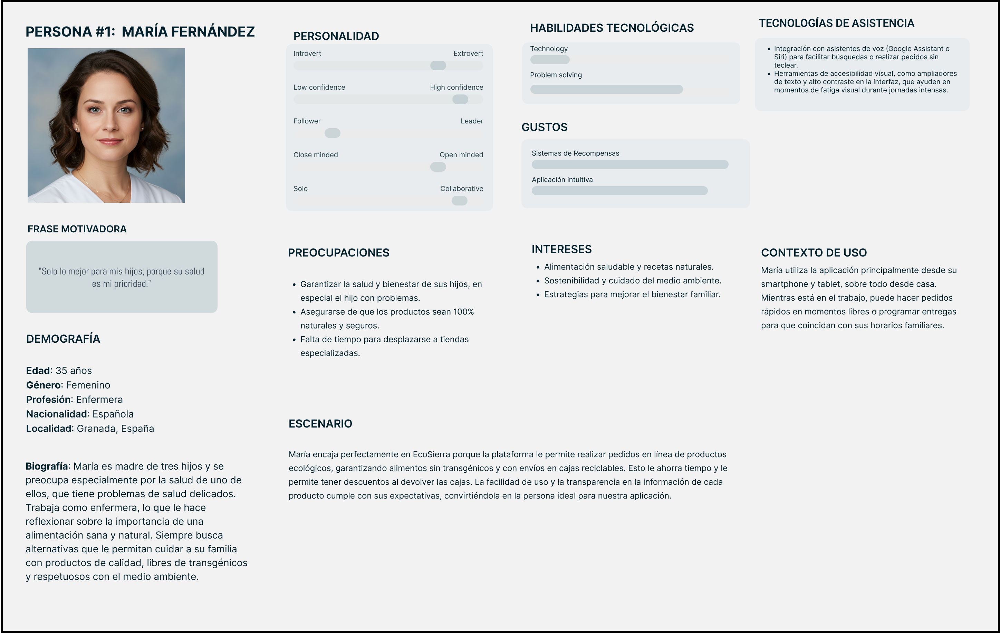 
**María Fernández**: Madre de tres hijos y se preocupa especialmente por la salud de uno de ellos, que tiene problemas de salud delicados. Trabaja como enfermera, lo que le hace reflexionar sobre la importancia de una alimentación sana y natural. Siempre busca alternativas que le permitan cuidar a su familia con productos de calidad, libres de transgénicos y respetuosos con el medio ambiente.

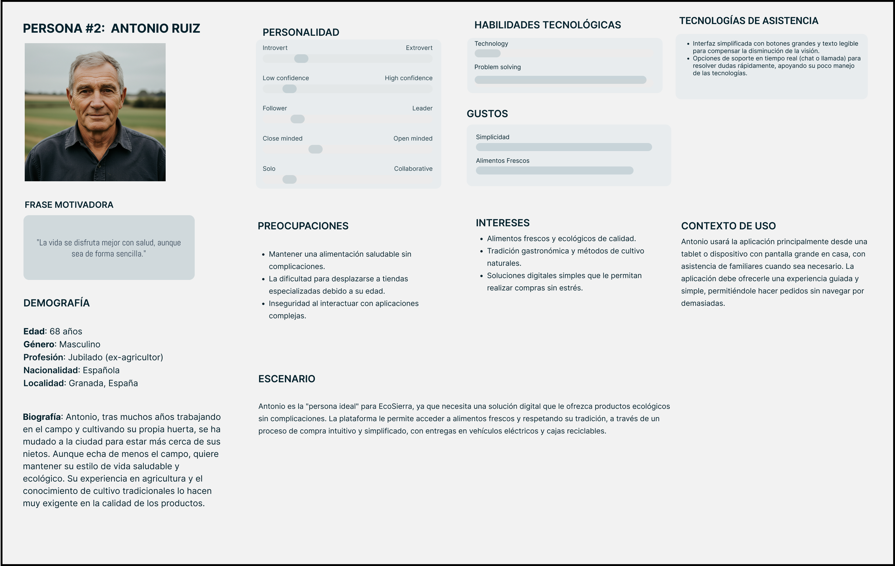 
**Antonio Ruiz**: Tras muchos años trabajando en el campo y cultivando su propia huerta, se ha mudado a la ciudad para estar más cerca de sus nietos. Aunque echa de menos el campo, quiere mantener su estilo de vida saludable y ecológico. Su experiencia en agricultura y el conocimiento de cultivo tradicionales lo hacen muy exigente en la calidad de los productos.

### 1.d User Journey Map
 
----
Los dos User Journey son situaciones comunes en la página web de www.valleyvega.org, en las que se intenta buscar un alimento y comprarlo. Ambas situaciones son increiblemente engorrosas y están mal diseñadas, con cantidad de fallos en todos los pasos del proceso.

A nuestra usuaria María Fernández le han recomendado comprar una variedad específica de aceitunas y no las ha podido encontrar mediante la búsqueda que supuestamente indexa todo el contenido de la web.
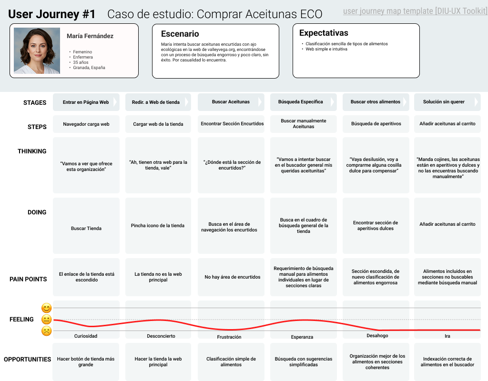
A nuestro usuario Antonio Ruiz ha decidido realizar una compra de acelgas para su familia pero debido a un error poco intuitivo no ha sido capaz de conseguirlo y tuvo que pedir ayuda a un familiar m√°s joven.
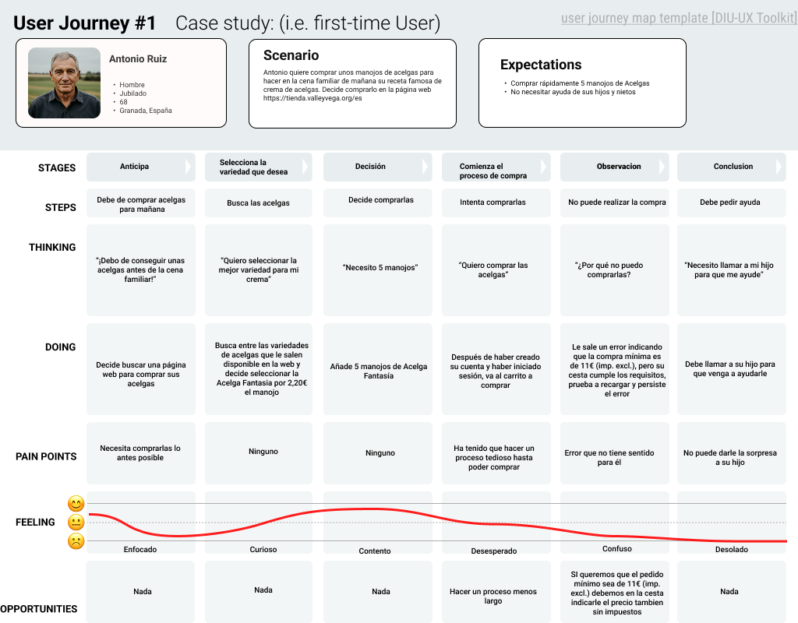

### 1.e Usability Review
 
----
- **Enlace al documento**:  
- **URL y Valoración numérica obtenida**: www.valleyvega.org / www.tienda.valleyvega.org - 60/100
- **Comentario sobre la revisión**:  Las web principal y tienda son webs diferentes y a la tienda es engorroso acceder, demostrando poca organización y coherencia en la estructura. La tienda contiene una serie de secciones mal organizadas y una búsqueda mal indexada con alimentos disponibles mediante las secciones pero no la búsqueda, algo completamente incomprensible. El checkout es engorroso y el precio mínimo no está bien clarificado. Por lo demás la web presenta un diseño atractivo con una paleta de colores agradable y una tipografía clara y legible.

 

## Paso 2. UX Design  

### 2.a Reframing / IDEACION: Feedback Capture Grid / EMpathy map 
 
----

Malla receptora de información

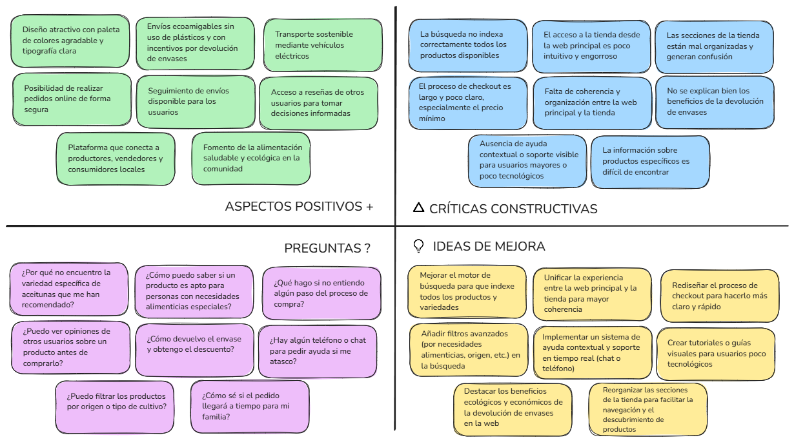

Mapa de empatía

----

Nuestro proyecto, EcoSierra Granada, se trata de una plataforma digital (web y móvil) que conecta a productores, vendedores y consumidores de mercados ecológicos en Granada. La propuesta se centra en:

- Envíos Ecoamigables:
No se usa plástico en los envíos. Se utilizan cajas de madera reciclada. Además, si el usuario devuelve el envase, se le ofrece un pequeño descuento en su siguiente compra.

- Transporte Sostenible:
Todos los medios de transporte (camiones, camionetas y motos) que se utilizan para la distribución son eléctricos, reduciendo así la huella de carbono.

Funcionalidades del Marketplace:
La plataforma permite realizar pedidos en línea con métodos de pago de forma segura. Además, incorpora funcionalidades como el seguimiento de envíos y acceso a reseñas de otros usuarios.

### 2.b ScopeCanvas

----

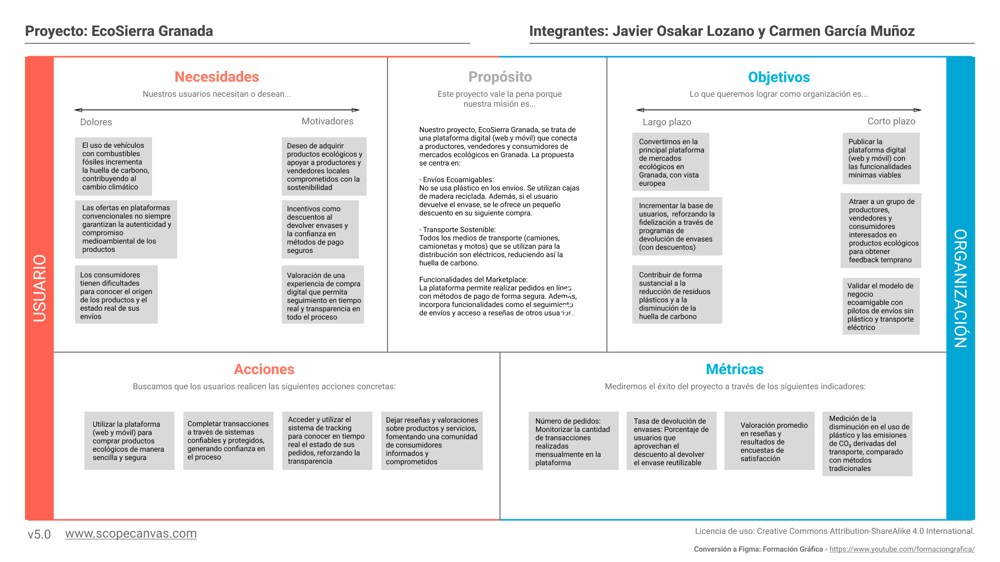

### 2.b User Flow (task) analysis 
 
-----

Hemos definido la siguiente Task Matrix con 15 tareas y 5 roles de usuario. Los roles considerados son: Consumidor, Vendedor, Productor, Repartidor y Administrador. Se considera una puntuación de prioridad del 1 al 5 (5 = más alta), y se incluye la suma total de puntos para cada tarea al final.

| Tarea                                    | Consumidor | Vendedor | Productor | Repartidor | Administrador | Total |
|------------------------------------------|------------|----------|-----------|------------|---------------|-------|
| 1. Buscar productos                      | 5          | 2        | 1         | 1          | 2             | 11    |
| 2. Ver detalles del producto             | 5          | 2        | 1         | 1          | 1             | 10    |
| 3. Realizar pedido                        | 5          | 3        | 2         | 2          | 2             | 14    |
| 4. Pagar compra                           | 5          | 2        | 1         | 1          | 1             | 10    |
| 5. Rastrear envío                         | 5          | 3        | 2         | 5          | 2             | 17    |
| 6. Calificar/reseñar producto             | 4          | 2        | 1         | 1          | 1             | 9     |
| 7. Gestionar devolución del envase        | 5          | 2        | 1         | 1          | 2             | 11    |
| 8. Contactar con servicio al cliente      | 4          | 2        | 1         | 1          | 3             | 11    |
| 9. Registrar cuenta                       | 5          | 5        | 5         | 5          | 3             | 23    |
| 10. Editar perfil                         | 4          | 4        | 4         | 4          | 2             | 18    |
| 11. Gestionar inventario                  | 1          | 5        | 4         | 1          | 3             | 14    |
| 12. Añadir producto                       | 1          | 5        | 5         | 1          | 3             | 15    |
| 13. Gestionar promociones                 | 2          | 4        | 3         | 1          | 3             | 13    |
| 14. Ver historial de pedidos              | 5          | 3        | 1         | 1          | 2             | 12    |
| 15. Gestionar devoluciones                | 3          | 3        | 2         | 2          | 3             | 13    |

User/Task flow del inicio de sesión

### 2.c IA: Sitemap + Labelling 
 
----

Sitemap

Labelling

  | Nombre | Descripción |
  | --- | --- |
  | Home (index.html) | P√°gina de inicio de la web |
  | Tienda (store.html) | P√°gina en la que se mostrar√° nuestra tienda con diferentes tipos de filtros |
  | Producto (product.html) | P√°gina de producto, se muestr√° el producto seleccionado y productos relacionados |
  | Carrito (cart.html) | Página de carrito, se mostrarán un listado de productos añadidos con su respectiva cantidad y precios |
  | Inicio/registro (sign.html) | Página de inicio y registro de la web. Dependiendo de que acción se desea hacer se usa un formulario u otro |
  | Sobre Nosotros (about_us.html) | Página en la que se indica información que se desea dar a conocer a nuestro público |
  | Contacto (contact.html) | Página de contacto para el público sobre posibles dudas o incidencias a través de un formulario |
  | Blog (blog.html) | Página de noticias con temática ecológica, donde se muestrán diferentes articulos resumidos |
  | Articulo (article.html) | Página de artículo donde se muestra la información de manera más extensa |

### 2.d Wireframes
 
-----

Se han realizado tres bocetos de las páginas correspondientes al inicio, a la tienda y al visualizador de producto. Mediante Figma se ha hehco un diseño responsive, que mostraremos imágenes de los diferentes frames de cada una de ellas.

#### 1920x1590

#### 1590x1200
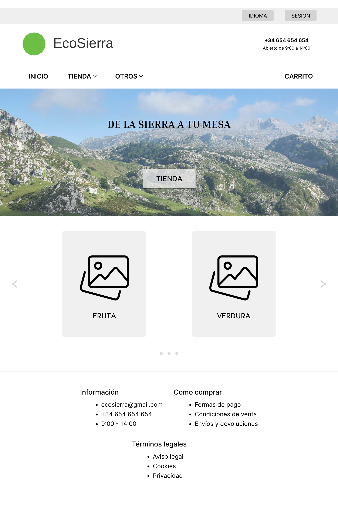

#### 1200x600
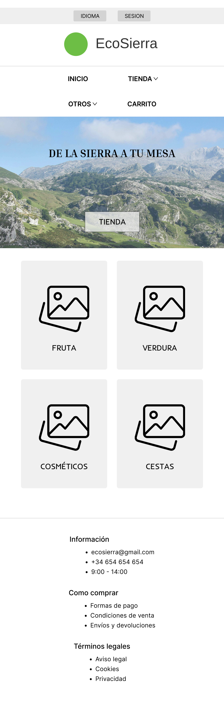

#### 600x320
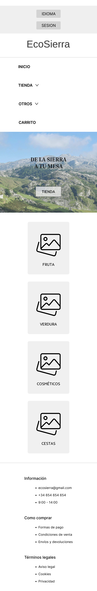

 

## Paso 3. Mi UX-Case Study (diseño)

### 3.a Moodboard

-----

#### LOGOTIPO

- Imagen .png

- Vectorial .svg

Hemos querido elegir un logotipo simple y directo, compuesto con el color verde como color principal, muy representativo de lo natural y ecológico, y el texto del nombre de la marca. La tipografía es sencilla y clara, para que sea fácil de leer y recordar y sobre todo de usar en plataformas web y móviles.

#### PALETA DE COLORES

| Muestra | Nombre                | Hex       | Uso / Justificación                                                                                         |
|:-------:|:----------------------|:----------|:-------------------------------------------------------------------------------------------------------------|
| 🟩      | **Verde Natural**     | `#78C043` | Color principal, tomado del logo. Evoca naturaleza, frescura y ecología.                                     |
| 🟫      | **Madera Reciclada**  | `#8B6F47` | Acento que recuerda las cajas de madera reciclada. Aporta calidez y refuerza el concepto “eco‐packaging”.     |
| 🟦      | **Azul Claro**        | `#66B2E8` | Color secundario para llamadas a la acción o elementos de tracking; ofrece sensación de confianza y tecnología. |
| ⚫️      | **Gris Carbón**       | `#333333` | Para texto y elementos UI; alto contraste y buena legibilidad sobre fondos claros.                          |
| ⚪️      | **Crema Suave**       | `#F5F5F2` | Fondo general; proporciona calidez y hace que los productos destaquen sin “cansar” la vista.       

#### ICONOS/SÍMBOLOS Y ESTILO (HeroIcons)

Estilo general

| Propiedad        | Valor                                  |
|:-----------------|:---------------------------------------|
| **Familia**      | Outline / Stroke                       |
| **Grosor**       | 2 px                                   |
| **Line cap/join**| Round                                  |
| **Tamaño base**  | 24 × 24 px (32 × 32 px en heroicons)   |
| **Color normal** | `#333333` (Gris Carbón)               |
| **Color hover**  | `#78C043` (Verde Natural)             |

---

#### Iconos de navegación y acciones globales

| Uso                | Icono                                                                                                                                                                                         |
|:-------------------|:----------------------------------------------------------------------------------------------------|
| Men√∫ hamburguesa   |  |
| Carrito de compra  |     |
| Usuario / sesión   |      |
| Selección de idioma|     |
| Buscar             |    |
| Teléfono           |     |
| Correo electrónico |     |
| Ubicación          |     |

#### Iconos de filtro y ordenación (columna lateral)

| Filtro / Orden        | Icono                                                                                           | Estado activo     |
|:----------------------|:------------------------------------------------------------------------------------------------|:------------------|
| Desplegable           |  | Rotar 180° (▲)    |
| M√°s vendidos          |   | Color `#78C043`   |
|

#### Iconos de producto y carrito (detalle de producto)

| Acción            | Icono                                                                                             |
|:------------------|:--------------------------------------------------------------------------------------------------|
| Añadir al carrito |      |
| Quitar (-)        |     |
| Envío             |      |
| Devolver envase   |       |

#### Iconos de estado y feedback

| Tipo                | Icono                                                                                           | Color              |
|:--------------------|:-----------------------------------------------------------------------------------------------|:-------------------|
| Éxito / Descuento   |  | `#78C043` (verde)  |
| Alerta / Error      |  | `#E94E4E` (rojo)   |
| Información extra   |          | `#66B2E8` (azul)   |

### 3.b Landing Page
 
----

Se ha diseñado la siguiente página promocional, conteniendo el logotipo, una breve descripción de la empresa y dos imágenes inspiradoras que expresan la filosofía y valores de la marca. Finalmente se presenta un botón de llamada a la acción que invita al usuario a ayudar a nuestro planeta, con el enlace a la web de la empresa.

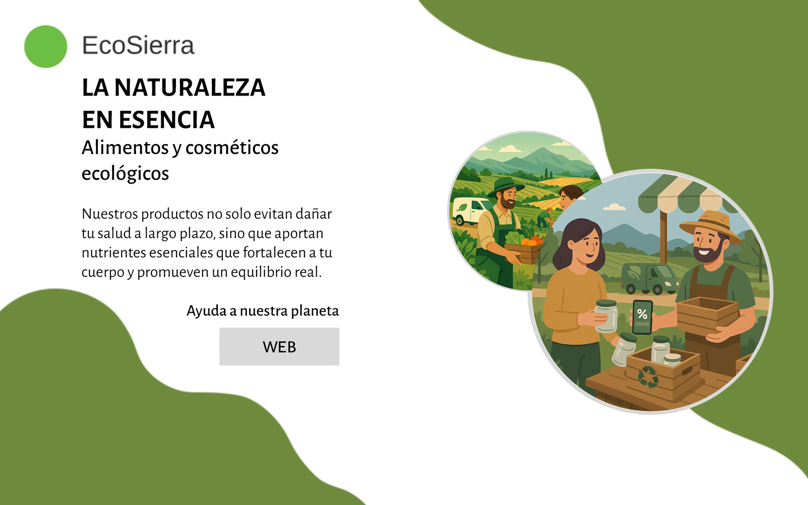

### 3.c Guidelines
 
----

, utilizando los siguientes patrones de diseño:

### Hero Image + Carousel (P√°gina de inicio)
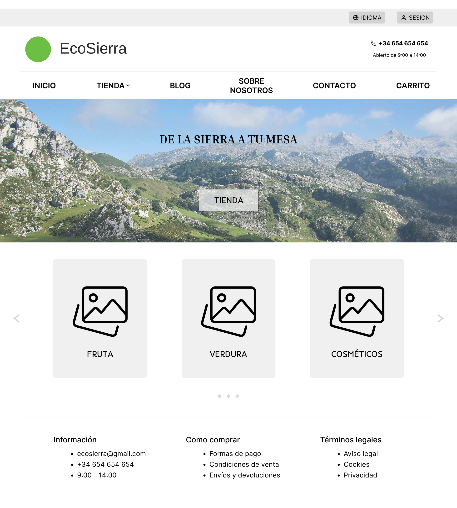

### Men√∫ hamburguesa (SubMen√∫)
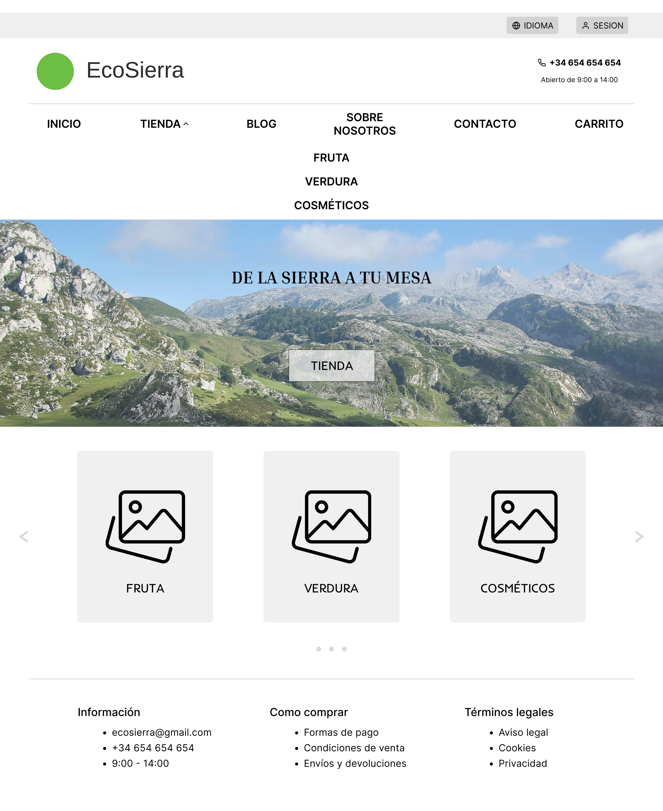

### Article List (Tienda)
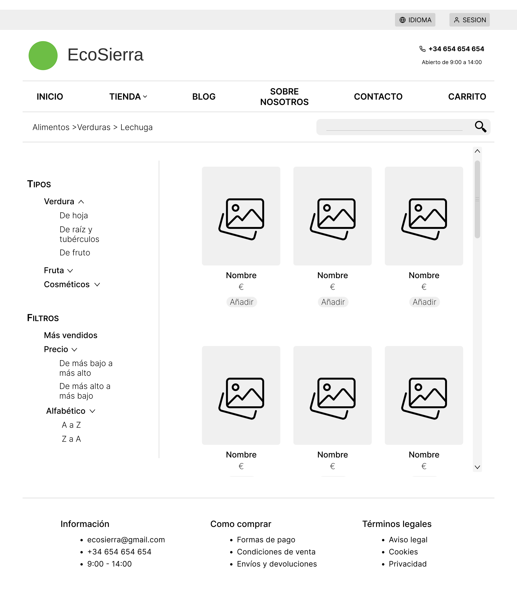

### Item Details (Detalles del producto)

### Form Input (Contacto)
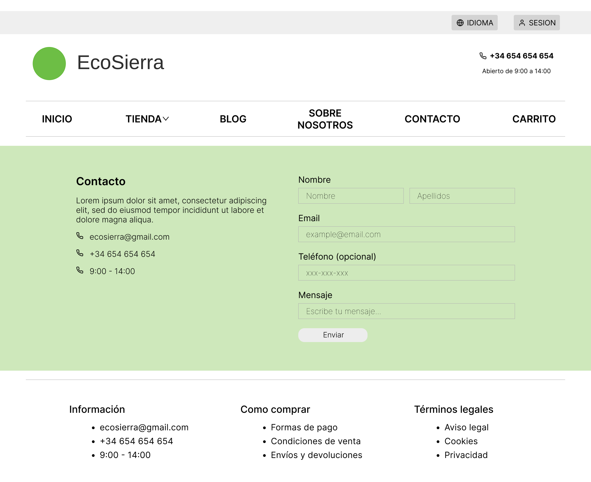

### Shopping Cart (Carrito de compra)
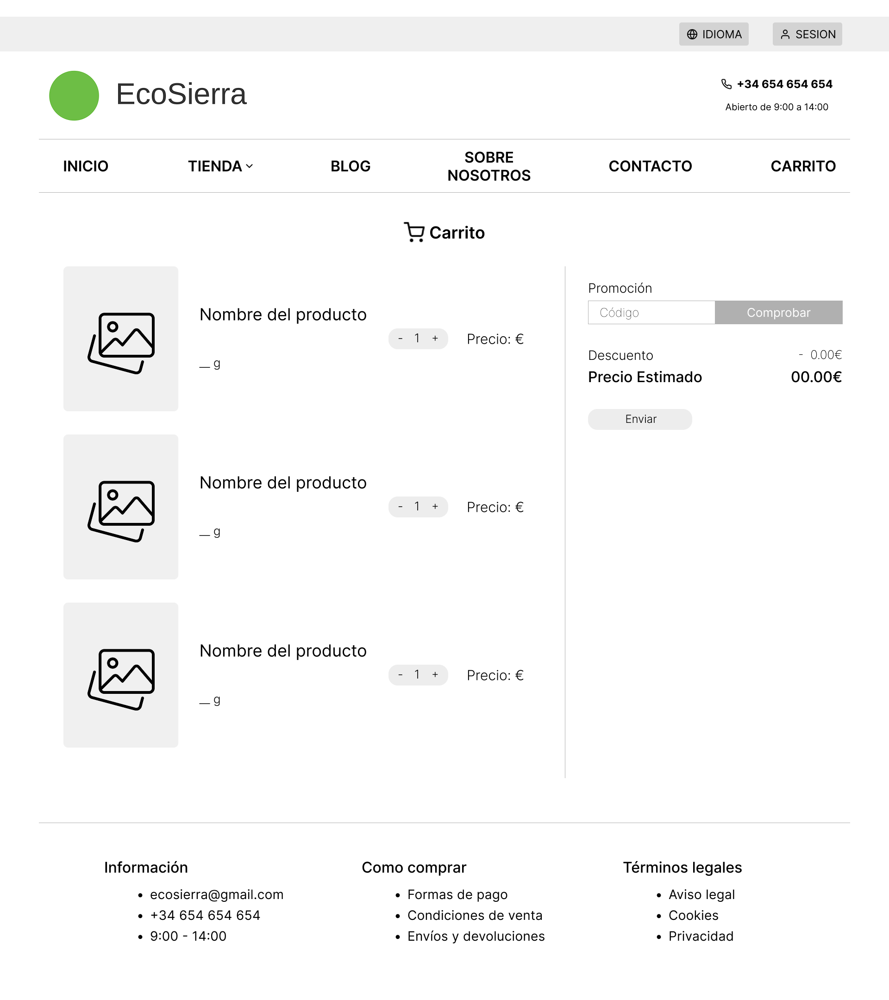

### About (Sobre nosotros)

### 3.d Mockup
 
----

Se ha realizado un mockup con navegabilidad simulada mediante animaciones de la aplicación para web [Mockup en Figma](https://www.figma.com/design/NFUHxHGGa9HnGKbSnbm49o/Protocolo-TOTAL-RP?m=auto&t=lJTwSbpXoMqKUMaR-6)

## Paso 4. Pruebas de Evaluación 

### 4.a Reclutamiento de usuarios 

-----

Se trata de una plataforma web para que los agricultores locales vendan sus productos directamente al consumidor, sin intermediarios y con menos transporte. Se prevee para el futuro que las entregas se hagan con vehículos de bajas emisiones para gastar menos energía. Así, los agricultores ponen sus precios con más margen de ganancia y los clientes compran más barato. Además, al fomentar cultivos nativos se usa mejor el agua y se reducen fertilizantes y pesticidas.

|   |   |   |   |   |   |   |   |
|---|---|---|---|---|---|---|---|
|#id. usuario|Sexo/edad|Ocupación|Experiencia internet|Plataforma|Perfil cubierto|TEST|SUS score|
|1|M/26|Estudiante universitario|Avanzado|PC|A|TEST|80|
|2|F/23|Estudiante universitario|Avanzado|PC|A|TEST|77.5|
|3|F/28|Diseñadora gráfica|Avanzado|Móvil/Tablet|A|TEST|92.5|
|4|M/35|Ingeniero|Avanzado|PC/Móvil|A|TEST|82.5|
|5|F/42|Profesora|Intermedio|PC|B|TEST|60|
|6|M/19|Estudiante universitario|Avanzado|Móvil|B|TEST|75|
|7|F/55|Administrativa|B√°sico|PC|B|TEST|30|
|8|M/31|Marketing digital|Avanzado|Móvil/PC|B|TEST|77.5|

### 4.b Diseño de las pruebas 
 
-----
Vamos a realizar diferentes pruebas para obtener un resultado final para poder comparar ambos casos y poder seleccionar con dichos resultados cu√°l es el mejor.
Las pruebas que realizaremos ser√°n:

  - **Checklist de usabilidad**: realizada por Javier y Carmen
  - **Eyetracking**: Se dividir√°n a los usuarios en dos secciones: del 1 al 4 para el caso A y del 5 al 8 para el caso B
  - **Cuestionario SUS**: Se responder√° de manera supervisada con los usuarios que se dividir√°n en dos secciones: del 1 al 4 para el caso A y del 5 al 8 para el caso B

### 4.c Cuestionario SUS
 
----

### Preguntas del Cuestionario SUS

El cuestionario SUS (System Usability Scale) consta de 10 preguntas est√°ndar que los usuarios deben calificar en una escala de 1 (totalmente en desacuerdo) a 5 (totalmente de acuerdo):

1. Creo que me gustaría usar este sistema frecuentemente
2. Encontré el sistema innecesariamente complejo
3. Pensé que el sistema era fácil de usar
4. Creo que necesitaría el apoyo de un técnico para poder usar este sistema
5. Encontré que las diversas funciones en este sistema estaban bien integradas
6. Pensé que había demasiada inconsistencia en este sistema
7. Me imagino que la mayoría de las personas aprenderían a usar este sistema muy rápidamente
8. Encontré el sistema muy engorroso de usar
9. Me sentí muy seguro usando el sistema
10. Necesité aprender muchas cosas antes de poder comenzar con este sistema

### Resultados del Cuestionario SUS

#### Caso A (Usuarios 1-4)

| Usuario | P1 | P2 | P3 | P4 | P5 | P6 | P7 | P8 | P9 | P10 | Puntuación SUS |
|---------|----|----|----|----|----|----|----|----|----|----|----------------|
| 1 (M/26) | 4 | 2 | 4 | 2 | 4 | 2 | 4 | 2 | 4 | 2 | 80 |
| 2 (F/23) | 4 | 2 | 4 | 2 | 3 | 2 | 4 | 2 | 4 | 2 | 77.5 |
| 3 (F/28) | 5 | 2 | 5 | 1 | 4 | 2 | 5 | 1 | 4 | 2 | 92.5 |
| 4 (M/35) | 4 | 2 | 4 | 2 | 4 | 2 | 4 | 2 | 4 | 1 | 82.5 |

**Promedio Caso A: 83.125**

#### Caso B (Usuarios 5-8)

| Usuario | P1 | P2 | P3 | P4 | P5 | P6 | P7 | P8 | P9 | P10 | Puntuación SUS |
|---------|----|----|----|----|----|----|----|----|----|----|----------------|
| 5 (F/42) | 3 | 3 | 3 | 3 | 3 | 3 | 3 | 3 | 3 | 3 | 60 |
| 6 (M/19) | 4 | 2 | 4 | 2 | 3 | 3 | 4 | 2 | 3 | 2 | 75 |
| 7 (F/55) | 2 | 4 | 2 | 4 | 2 | 4 | 2 | 4 | 2 | 4 | 30 |
| 8 (M/31) | 4 | 2 | 4 | 2 | 3 | 3 | 4 | 2 | 4 | 2 | 77.5 |

**Promedio Caso B: 60.625**

### C√°lculo del Net Promoter Score (NPS)

Para calcular el NPS, utilizamos la pregunta 1 del cuestionario SUS como indicador de recomendación, convirtiendo la escala de 5 puntos a una escala de 10 puntos:

#### Clasificación de usuarios:
- **Promotores** (puntuación 9-10): Usuarios que respondieron 5 en P1
- **Pasivos** (puntuación 7-8): Usuarios que respondieron 4 en P1  
- **Detractores** (puntuación 0-6): Usuarios que respondieron 1-3 en P1

#### Resultados NPS:

**Caso A:**
- Promotores: 1 usuario (25%) - Usuario 3
- Pasivos: 3 usuarios (75%) - Usuarios 1, 2, 4
- Detractores: 0 usuarios (0%)
- **NPS Caso A: 25%**

**Caso B:**
- Promotores: 0 usuarios (0%)
- Pasivos: 3 usuarios (75%) - Usuarios 6, 8
- Detractores: 1 usuario (25%) - Usuario 7
- **NPS Caso B: -25%**

### An√°lisis de Resultados

Los resultados del cuestionario SUS confirman la superioridad del **Caso A** sobre el **Caso B**:

- **Puntuación SUS promedio**: Caso A (83.125) vs Caso B (60.625)
- **NPS**: Caso A (+25%) vs Caso B (-25%)

El Caso A demuestra una usabilidad significativamente mejor, especialmente notable en:
- Mayor facilidad de uso percibida
- Mejor integración de funciones
- Mayor confianza del usuario
- Menor curva de aprendizaje

El Caso B presenta desafíos particulares para usuarios con experiencia básica (Usuario 7), mientras que el Caso A mantiene una experiencia más consistente en diferentes niveles de experiencia técnica.

### 4.d A/B Testing
 
-----

- El resultado final del Caso A frente al B ha demostrado que una mejor usabilidad no solo mejora la satisfacción del usuario, sino que también puede influir en la percepción general de la plataforma y su efectividad en cumplir con los objetivos del proyecto.

### 4.e Aplicación del método Eye Tracking 

----

Se han creado dos test en la plataforma de Gazerecorder, en ambos se han añadido las mismas template para poder compararlas. Estas son: inicio, tienda, producto, carrito y sobre nosotros.

**Enlace al test caso A**: https://app.gazerecorder.com/Study/Test?StudyID=f027e6cec345a44bb37466b8c2397e6c&lang=es&RespondentID=null

**Enlace al test caso B**: https://app.gazerecorder.com/Study/Test?StudyID=ef4248359652a88fa04db8e9bb470c07&lang=es&RespondentID=null

Adjuntamos las fotos comparativas de cada uno

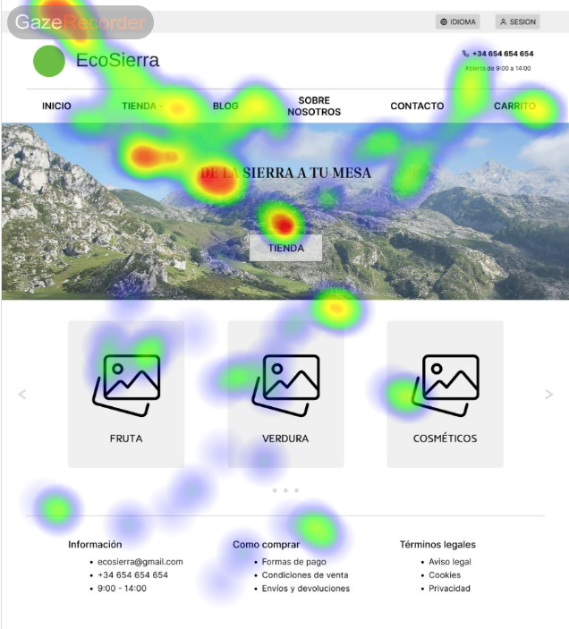 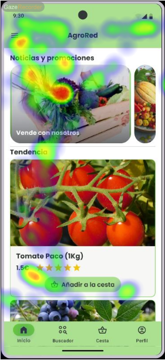
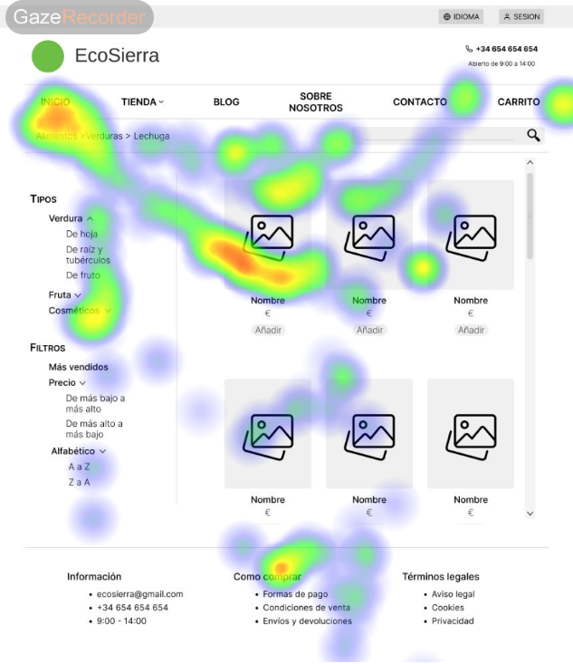 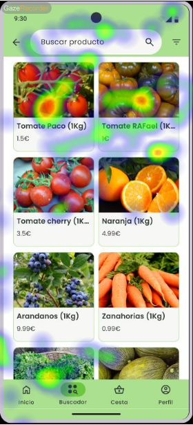
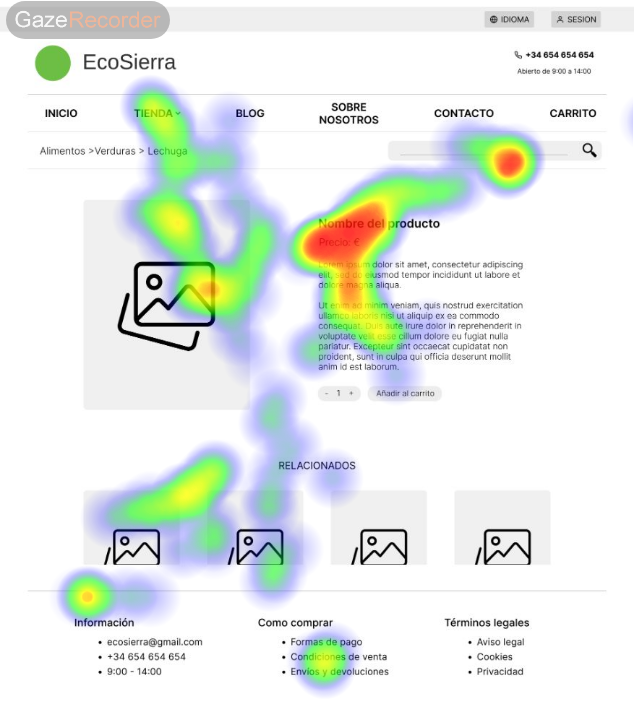 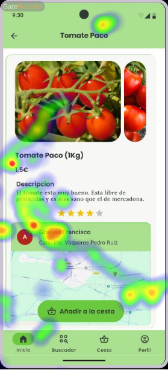
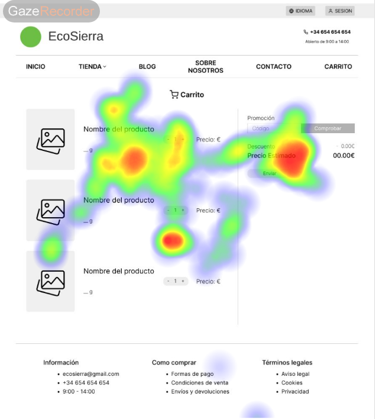 
 

### 4.f Usability Report de B
 
-----

Archivo del informe: [Usability-Report-B.md](P4/Usability-Report-B.md)

 
